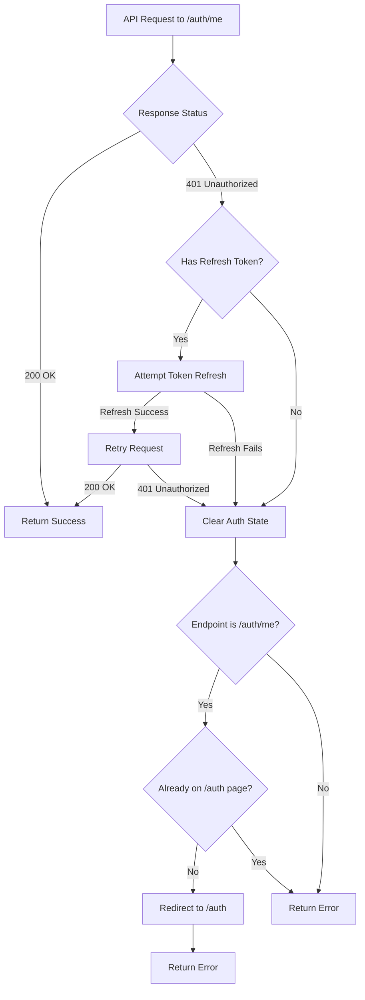

# 401 Session Expired Redirect Implementation

## Problem

When a session expires and `/auth/me` returns 401, the client clears auth tokens but doesn't redirect to the login page, leaving users with a stale session state.

## Solution Overview

Add targeted 401 handling in the API client for `/auth/me` endpoint that:

1. Detects 401 errors after token refresh fails
2. Clears authentication state
3. Redirects to `/auth` page (unless already there)
4. Preserves all existing OAuth callback and error handling logic

## Implementation Details

### 1. Update `request` method in `client.ts`

**File:** [`src/integrations/api/client.ts`](src/integrations/api/client.ts)**Changes:**

- After token refresh fails (or if no refresh token exists), check if the endpoint is `/auth/me`
- If it's `/auth/me` and we're not already on `/auth`, redirect to login
- Handle 401 on retry response as well (if refresh succeeded but retry still returns 401)
- Use `window.location.replace()` to avoid adding to browser history
- Add console logging for debugging

**Key considerations:**

- Only redirect for `/auth/me` endpoint (not other endpoints that might legitimately return 401)
- Check `window.location.pathname !== '/auth'` before redirecting to prevent loops
- Only redirect in browser environment (`typeof window !== 'undefined'`)
- Preserve existing error return structure for other callers

### 2. Update `fetchAdminStatus` in `useAuth.tsx`

**File:** [`src/hooks/useAuth.tsx`](src/hooks/useAuth.tsx)**Changes:**

- Detect 401 errors in the error result
- Clear user state (session, user, isAppAdmin, isVerified) when 401 is detected
- The redirect will be handled by `client.ts`, so this just ensures UI state is cleared
- Keep existing error logging for non-401 errors

**Key considerations:**

- Don't duplicate redirect logic (handled by client.ts)
- Ensure state is cleared synchronously so UI updates immediately
- Preserve existing behavior for non-401 errors

### 3. Preserve Existing Behavior

**OAuth Callbacks:**

- The redirect logic checks `window.location.pathname !== '/auth'` which prevents interference with OAuth callbacks
- OAuth callbacks are handled in `useAuth.tsx` useEffect hooks which run independently
- No changes needed to OAuth flow

**Other Endpoints:**

- Only `/auth/me` triggers redirect - other endpoints continue to return errors normally
- Existing error handling in components remains unchanged

**Session Initialization:**

- Existing 401 handling in `initializeSession` remains as fallback
- New redirect logic in `client.ts` provides immediate response for all `/auth/me` calls

## Flow Diagram

## Testing Considerations

1. **Session Expiration:**

- Expire session on backend
- Call `/auth/me` from authenticated page
- Verify redirect to `/auth` occurs

2. **OAuth Callbacks:**

- Complete OAuth flow
- Verify redirect doesn't interfere with callback processing

3. **Already on Auth Page:**

- Trigger 401 while on `/auth` page
- Verify no redirect loop occurs

4. **Other Endpoints:**

- Trigger 401 on non-auth endpoints
- Verify normal error handling (no redirect)

5. **Token Refresh:**

- Expire access token but keep refresh token valid
- Verify refresh succeeds and no redirect occurs

## Files to Modify

1. `src/integrations/api/client.ts` - Add 401 redirect logic in `request` method
2. `src/hooks/useAuth.tsx` - Update `fetchAdminStatus` to clear state on 401

## Risk Assessment

**Low Risk:**

- Changes are isolated to specific endpoint (`/auth/me`)
- Redirect only occurs when not already on `/auth` page
- Existing error handling preserved for all other cases