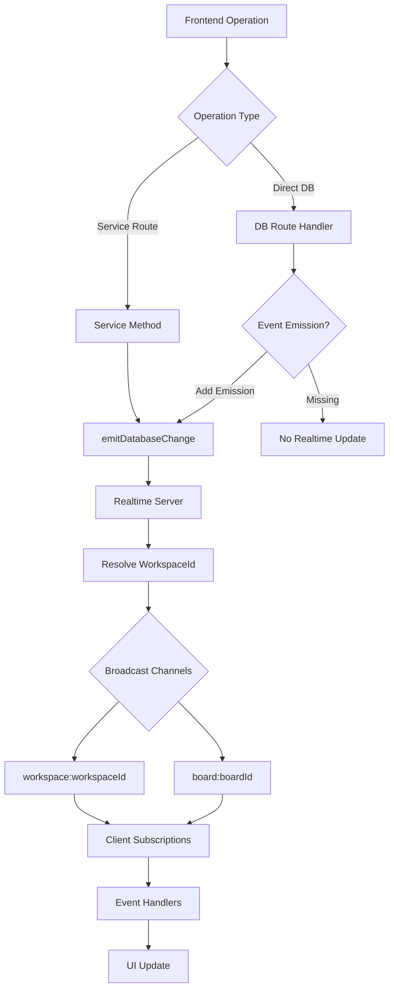

# Fix Realtime Event Emissions and Move Operations

Comprehensive plan to fix missing realtime event emissions and ensure card/column move operations work correctly. Addresses both the infrastructure improvements from the previous plan and the critical gap of missing event emissions in database routes.

## Problem Analysis

### Critical Issues Found

1. **Missing Event Emissions in Database Routes**: `/api/db/:table` routes (POST, PATCH, DELETE) don't emit realtime events except for profiles table

- Card attachments created via `api.from('card_attachments').insert()` don't trigger realtime
- Any direct database operations bypass service layer and don't emit events
- Impact: Attachments, direct inserts/updates/deletes don't update in realtime

2. **Move/Reorder Operations**: Services emit events correctly, but need verification:

- Card reorder service emits events (verified)
- Column reorder service emits events (verified)
- RPC functions call services correctly (verified)
- Potential issues: workspaceId resolution, event payload structure, client-side processing

3. **WorkspaceId Resolution**: For `card_*` tables, workspaceId must be resolved via card → column → board → workspace lookup

- Current implementation does this but may have performance/caching issues
- If resolution fails, events won't broadcast to workspace channel

## Architecture Overview

## Implementation Plan

### Phase 1: Add Event Emissions to Database Routes

**1.1 Update POST `/api/db/:table` Route** (`backend/src/routes/db.ts` lines 202-228)

- After successful insert, emit `INSERT` event via `emitDatabaseChange()`
- **Note**: Prisma returns records in camelCase format automatically - pass records as-is to `emitDatabaseChange()`
- Resolve `boardId`/`workspaceId` for proper channel routing (use camelCase field names from Prisma records)
- Handle batch inserts (array of records)
- For `card_*` tables, resolve workspaceId via card lookup using `cardId` (camelCase) from inserted record

**1.2 Update PATCH `/api/db/:table` Route** (`backend/src/routes/db.ts` lines 230-287)

- Before update, fetch old records for comparison (Prisma returns camelCase)
- After successful update, fetch new records (Prisma returns camelCase)
- Emit `UPDATE` event with old/new records (both in camelCase format)
- Handle batch updates (updateMany) - fetch old records before update, new records after
- Resolve `boardId`/`workspaceId` for proper channel routing using camelCase field names

**1.3 Update DELETE `/api/db/:table` Route** (`backend/src/routes/db.ts` lines 289-323)

- Before delete, fetch records to be deleted (Prisma returns camelCase)
- Emit `DELETE` event with old records (in camelCase format)
- Resolve `boardId`/`workspaceId` for proper channel routing using camelCase field names from fetched records

**1.4 Create Helper Functions for WorkspaceId Resolution**

- Create `resolveWorkspaceIdForTable()` helper in `db.ts`
- Handle different table types (cards, columns, card_*, etc.)
- **Support both field name formats**: Accept both `boardId`/`board_id`, `cardId`/`card_id`, `workspaceId`/`workspace_id` for compatibility
- Cache workspaceId lookups to avoid performance issues
- Reuse logic from `realtime/server.ts` but make it accessible to routes
- Ensure helper works with Prisma records (camelCase) from `db.ts` routes

### Phase 2: Verify and Fix Move/Reorder Operations

**2.1 Verify Event Emission in Reorder Services**

- Confirm `cardService.reorder()` emits events correctly (already verified - lines 258-267)
- Confirm `columnService.reorder()` emits events correctly (already verified - lines 166-175)
- Check that events include proper `boardId` for channel routing

**2.2 Verify WorkspaceId Resolution for Move Events**

- Check that `emitDatabaseChange()` correctly resolves workspaceId for card/column updates
- Verify workspaceId is included in event payload
- Ensure events broadcast to both `workspace:` and `board:` channels

**2.3 Test Event Payload Structure**

- Verify UPDATE events include both `new` and `old` records
- **Verify field names are camelCase**: Check that payloads use `boardId`, `cardId`, `workspaceId`, `userId` (not `board_id`, `card_id`, etc.)
- Check that `changedFields` (from Phase 5 optimization) doesn't break client processing
- Ensure position changes are included in payload
- Test that frontend can access all fields using camelCase names

**2.4 Fix Client-Side Event Processing for Moves**

- Review `BoardPage.tsx` event handlers (lines 467-808)
- Ensure position updates are processed correctly
- Fix any timestamp conflict resolution issues
- Verify optimistic updates don't interfere with realtime events

### Phase 3: Improve WorkspaceId Resolution Performance

**3.1 Optimize WorkspaceId Caching**

- Enhance caching in `realtime/server.ts` for `card_*` table lookups
- Cache card → workspaceId mappings to avoid repeated lookups
- Invalidate cache when cards/columns/boards are moved/deleted

**3.2 Add WorkspaceId to Database Route Helpers**

- Create shared helper for workspaceId resolution
- Use same caching strategy across routes and realtime server
- Reduce database queries for batch operations

### Phase 4: Handle Edge Cases

**4.1 Batch Operations**

- Ensure batch inserts/updates emit individual events per record
- Or emit single batch event with array of changes (prefer individual for granularity)
- Handle transaction rollbacks - don't emit events if transaction fails

**4.2 Error Handling**

- Wrap event emissions in try-catch to prevent route failures
- Log warnings if event emission fails but don't block operation
- Ensure database operations succeed even if realtime fails

**4.3 Table Name Consistency**

- Verify table names match between server emissions and client subscriptions
- Handle both camelCase (Prisma) and snake_case (database) formats
- Ensure `card_attachments`, `card_subtasks`, etc. match exactly

**4.4 Field Name Conversion (snake_case ↔ camelCase)**

- **Database stores**: snake_case (`board_id`, `card_id`, `workspace_id`, `user_id`)
- **Prisma returns**: camelCase (`boardId`, `cardId`, `workspaceId`, `userId`)
- **Frontend expects**: camelCase (`boardId`, `cardId`, `workspaceId`, `userId`)
- **Current handling**: `realtime/server.ts` already handles both formats in ID resolution (lines 534, 577, 584, 588)
- **Required actions**:
  - Ensure Prisma records (camelCase) are passed to `emitDatabaseChange()` correctly
  - When fetching records in `db.ts` routes, verify they're in camelCase format (Prisma handles this automatically)
  - In workspaceId resolution helpers, support both `boardId`/`board_id`, `cardId`/`card_id`, etc.
  - Verify event payloads sent to frontend use camelCase consistently
  - Test that frontend event handlers can access fields using camelCase names

### Phase 5: Integration with Existing Plan

**5.1 Leverage Existing Infrastructure**

- Use existing `emitDatabaseChange()` function from `realtime/emitter.ts`
- Utilize workspace subscription registry from previous plan
- Benefit from connection persistence improvements

**5.2 Payload Optimization**

- Ensure new event emissions use optimized payload structure
- For UPDATE events, include `changedFields` (from Phase 5 of previous plan)
- Maintain backward compatibility with full record format

**5.3 Subscription Management**

- Verify workspace subscriptions are active when events are emitted
- Ensure subscription registry persists across navigation
- Test that events are received even after page refresh

## Files to Modify

### Backend Files

1. **[backend/src/routes/db.ts](backend/src/routes/db.ts)**

- Add event emissions to POST route (lines 202-228)
- Add event emissions to PATCH route (lines 230-287)
- Add event emissions to DELETE route (lines 289-323)
- Create helper functions for workspaceId resolution

2. **[backend/src/realtime/server.ts](backend/src/realtime/server.ts)**

- Enhance workspaceId caching for `card_*` tables
- Export workspaceId resolution helper for use in routes
- Optimize `resolveWorkspaceId()` method

3. **[backend/src/realtime/emitter.ts](backend/src/realtime/emitter.ts)**

- Verify `emitDatabaseChange()` handles all table types correctly
- Ensure proper error handling

### Frontend Files (Verification/Fixes)

4. **[src/pages/BoardPage.tsx](src/pages/BoardPage.tsx)**

- Verify event handlers process position updates correctly
- Fix any issues with optimistic update conflict resolution
- Ensure move operations trigger proper realtime updates

5. **[src/realtime/workspaceSubscriptions.ts](src/realtime/workspaceSubscriptions.ts)**

- Verify subscriptions include all necessary table bindings
- Ensure `card_attachments`, `card_subtasks` are subscribed

## Testing Strategy

1. **Database Route Events**

- Create attachment via direct DB operation → verify realtime update
- Update attachment → verify realtime update
- Delete attachment → verify realtime update
- Test with multiple users to verify cross-user updates

2. **Move Operations**

- Drag card within column → verify position updates in realtime
- Drag card between columns → verify columnId and position update
- Drag column to reorder → verify position updates
- Test with multiple users moving simultaneously

3. **WorkspaceId Resolution**

- Verify events broadcast to correct workspace channel
- Test with cards in different workspaces
- Verify caching reduces database queries
- **Test field name handling**: Verify workspaceId resolution works with both camelCase (`boardId`, `cardId`) and snake_case (`board_id`, `card_id`) field names for backward compatibility

4. **Edge Cases**

- Batch operations (multiple cards/columns moved)
- Rapid successive moves
- Network interruptions during moves
- Permission changes during operations

## Success Criteria

- All database operations (insert/update/delete) emit realtime events
- Card and column moves update in realtime for all active users
- Attachments, subtasks, labels update in realtime
- WorkspaceId resolution is efficient and correct