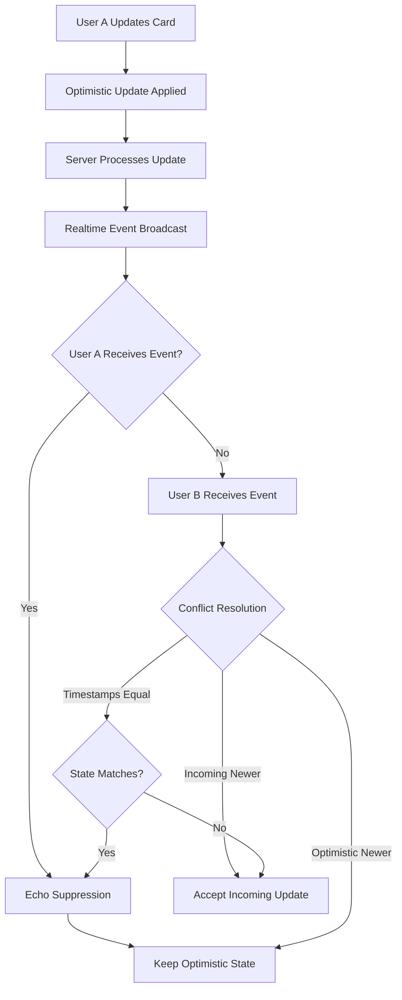
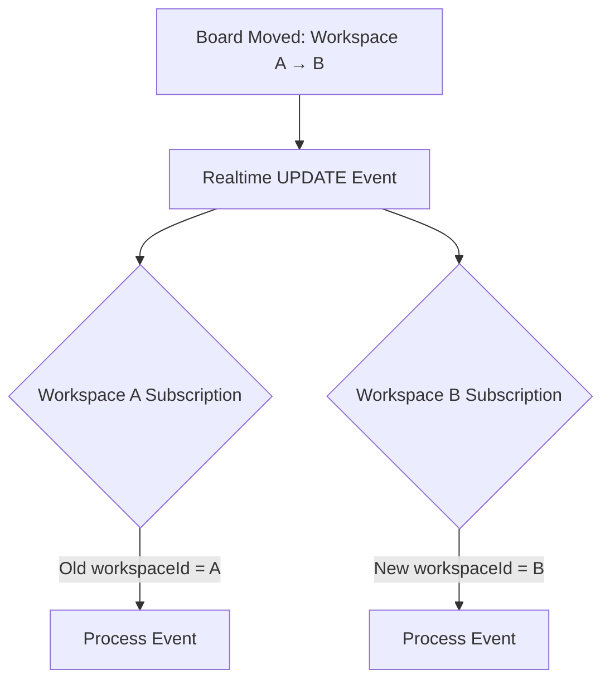

# Fix Realtime Update Issues

## Problem Analysis

Three issues prevent realtime updates from working correctly:

1. **Board workspace changes**: When a board is moved from workspace A to workspace B, the board doesn't disappear from workspace A's UI because the subscription only processes events where the new `workspaceId` matches the subscription's workspace.
2. **BoardPage not showing updates**: Card updates may be incorrectly filtered out when columns aren't fully loaded, or events are processed before columns exist.
3. **Source-of-truth verification**: The existing optimistic update system correctly treats the user making the update as the source of truth. The fixes must preserve this behavior.

## Current Source-of-Truth Model

The system correctly implements source-of-truth via:

- **Optimistic updates**: User's changes update UI immediately and are tracked in `pendingCardUpdatesRef`
- **Echo suppression**: Realtime events matching optimistic state exactly are ignored
- **Conflict resolution**: If optimistic timestamp is newer → keep optimistic; if incoming is newer → accept incoming

The fixes below preserve this model - they only ensure events are properly received and routed.

## Implementation Plan

### 1. Fix Board Workspace Change Handling in workspaceSubscriptions.ts

**File**: `src/realtime/workspaceSubscriptions.ts`

**Location**: Lines 44-58 (board UPDATE handler)**Issue**: Only processes events where new `workspaceId` matches subscription workspace. When board moves FROM workspace A TO workspace B:

- Workspace A subscription: Doesn't receive event (new workspaceId is B, not A) → board stays in UI
- Workspace B subscription: Receives event (new workspaceId is B) → board added/updated

**Fix**: Process events for both old and new workspaceId:

```typescript
{
  event: 'UPDATE',
  table: 'boards',
  handler: (payload) => {
    const board = payload.new as { workspaceId?: string; id?: string };
    const oldBoard = payload.old as { workspaceId?: string; id?: string };
    const oldWorkspaceId = oldBoard?.workspaceId;
    const newWorkspaceId = board?.workspaceId;
    
    // Process if board belongs to this workspace (new workspaceId)
    if (board?.workspaceId === workspaceId) {
      logRealtime(topic, 'board update', { id: board.id });
      handlers.onBoardUpdate?.(payload.new || {}, payload);
      if (board.id) {
        handlers.onParentRefresh?.('board', board.id);
      }
    }
    // Also process if board was moved FROM this workspace (old workspaceId)
    // This allows the old workspace to remove the board from its list
    else if (oldWorkspaceId === workspaceId && newWorkspaceId !== workspaceId) {
      logRealtime(topic, 'board moved from workspace', { 
        id: board.id, 
        from: oldWorkspaceId, 
        to: newWorkspaceId 
      });
      // Pass old board data so Home.tsx can remove it
      handlers.onBoardUpdate?.(payload.old || {}, payload);
    }
  },
}
```

**Note**: When processing the old workspace case, we pass `payload.old` so Home.tsx can identify it as a DELETE-like operation for that workspace.

### 2. Fix Board Workspace Change Handling in Home.tsx

**File**: `src/pages/Home.tsx`

**Location**: Lines 321-325 (board UPDATE handler)**Issue**: When board workspaceId changes, the board should be removed from old workspace's list and added to new workspace's list. Currently just merges state.**Fix**: Detect workspaceId changes and handle appropriately:

```typescript
} else if (event.eventType === 'UPDATE') {
  const oldBoard = event.old as unknown as Board | null;
  const newWorkspaceId = boardData.workspaceId;
  const oldWorkspaceId = oldBoard?.workspaceId;
  
  // Check if workspace changed
  if (oldWorkspaceId && newWorkspaceId && oldWorkspaceId !== newWorkspaceId) {
    // Board moved to different workspace
    setBoards((prevBoards) => {
      // Check if this board exists in the old workspace's list
      const existingBoard = prevBoards.find((b) => b.id === boardData.id);
      
      // If board exists with old workspaceId, remove it (moved away)
      if (existingBoard && existingBoard.workspaceId === oldWorkspaceId) {
        return prevBoards.filter((b) => !(b.id === boardData.id && b.workspaceId === oldWorkspaceId));
      }
      
      // If board doesn't exist or has different workspaceId, add/update it
      // This handles the case where the new workspace receives the update
      if (!existingBoard || existingBoard.workspaceId !== newWorkspaceId) {
        const filtered = prevBoards.filter((b) => b.id !== boardData.id);
        return [...filtered, boardData];
      }
      
      // Normal update (workspaceId didn't change)
      return prevBoards.map((b) => (b.id === boardData.id ? { ...b, ...boardData } : b));
    });
  } else {
    // Normal update - merge with existing state
    setBoards((prevBoards) =>
      prevBoards.map((b) => (b.id === boardData.id ? { ...b, ...boardData } : b))
    );
  }
}
```

**Note**: This preserves source-of-truth - the server's update (via realtime) is the source of truth for workspace changes.

### 3. Fix Card Update Filtering in BoardPage.tsx

**File**: `src/pages/BoardPage.tsx`

**Location**: Lines 599-618 (onCardUpdate handler start)**Issue**: Card updates may be incorrectly filtered when:

- Columns aren't loaded yet (`columnsLoadedRef.current === false`)
- Column doesn't exist in ref but should be processed

**Current Logic**:

```typescript
if (columnsLoadedRef.current && columnIdsRef.current.length > 0 && !columnBelongsToBoard) {
  // Buffer event
  return;
}
```

**Problem**: If `columnsLoadedRef.current === false`, the event continues processing but columns don't exist yet, causing issues.**Fix**: Only process card updates after columns are loaded, and improve buffering logic:

```typescript
onCardUpdate: (card, event) => {
  const cardData = card as unknown as DbCard;
  const cardColumnId = cardData.columnId;
  
  // Check if column belongs to board - use ref for synchronous check
  const columnBelongsToBoard = columnIdsRef.current.includes(cardColumnId);
  
  // If columns aren't loaded yet, buffer the event (will be processed after columns load)
  if (!columnsLoadedRef.current) {
    pendingCardEventsRef.current.push({
      card: cardData,
      event,
      timestamp: Date.now(),
    });
    return;
  }
  
  // If columns are loaded but column doesn't exist, buffer the event
  // (might be a new column that hasn't been processed yet)
  if (columnIdsRef.current.length > 0 && !columnBelongsToBoard) {
    pendingCardEventsRef.current.push({
      card: cardData,
      event,
      timestamp: Date.now(),
    });
    // Set timeout to process buffered events after a short delay
    setTimeout(() => {
      processBufferedCardEvents();
    }, 100);
    return;
  }
  
  // Columns are loaded and column exists (or no columns yet) - process normally
  // ... rest of existing card update logic (lines 620-807) ...
}
```

**Note**: This preserves source-of-truth - events are buffered until columns are ready, then processed with existing conflict resolution logic.

### 4. Verify Column Update Processing

**File**: `src/pages/BoardPage.tsx`

**Location**: Lines 467-470 (onColumnUpdate handler start)**Verification**: Column updates correctly filter by `boardId`:

```typescript
if (columnData.boardId !== boardId) return;
```


This is correct - no changes needed. Column updates are properly filtered.

### 5. Verify Source-of-Truth Model Preservation

**Files**: `src/pages/BoardPage.tsx` (lines 714-754)

**Verification**: The existing conflict resolution logic correctly implements source-of-truth:

- Optimistic updates tracked in `pendingCardUpdatesRef`
- Echo suppression when realtime event matches optimistic state

- Timestamp-based conflict resolution (newer timestamp wins)

- User's optimistic update is source of truth until newer update arrives

**No changes needed** - fixes only improve event routing/filtering, not conflict resolution.

## Testing Checklist

After implementation:

1. ✅ User A moves board from workspace A to workspace B → User B (subscribed to A) sees board disappear from A

2. ✅ User A moves board from workspace A to workspace B → User B (subscribed to B) sees board appear in B

3. ✅ User A updates card on BoardPage → User A sees update immediately (optimistic)

4. ✅ User A updates card on BoardPage → User B sees update in realtime

5. ✅ User A and User B update same card simultaneously → Newer timestamp wins (source-of-truth preserved)

6. ✅ User A updates card → Realtime echo arrives → Echo suppressed (no duplicate update)

7. ✅ BoardPage receives card update before columns load → Event buffered, processed after columns load

8. ✅ BoardPage receives card update for non-existent column → Event buffered, processed if column appears

## Files to Modify

1. `src/realtime/workspaceSubscriptions.ts` - Fix board UPDATE handler to process old workspaceId

2. `src/pages/Home.tsx` - Fix board UPDATE handler to handle workspaceId changes

3. `src/pages/BoardPage.tsx` - Fix card update filtering to handle unloaded columns

## Implementation Notes

### Source-of-Truth Model

The fixes preserve the existing source-of-truth model:

- **Optimistic updates**: User's changes are immediate and tracked
- **Conflict resolution**: Timestamp-based (newer wins)

- **Echo suppression**: Matching events are ignored

- **Server as final authority**: After conflict resolution, server state wins

The fixes only improve:

- **Event routing**: Ensuring events reach the right handlers
- **Event filtering**: Ensuring events aren't incorrectly dropped

- **State synchronization**: Ensuring UI reflects server state correctly

### Event Flow Diagram




### Board Workspace Change Flow

