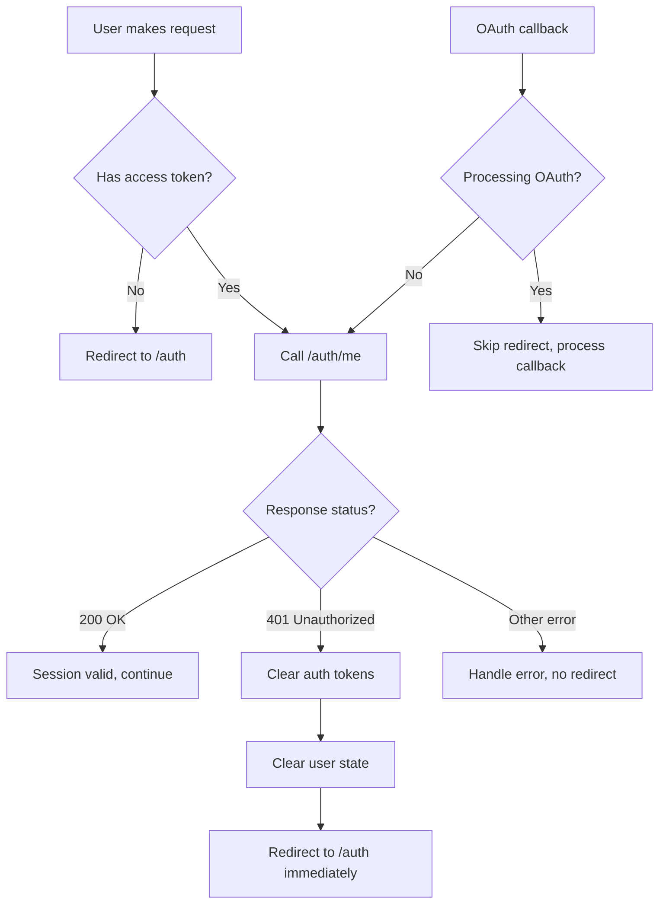

# Fix Session Expiration Redirect

## Problem

When `/auth/me` returns 401 (session expired), the application clears tokens but doesn't immediately redirect to login. This leaves the session in an inconsistent state until React state updates propagate, causing a delay and potential race conditions.

## Solution Overview

1. Add immediate redirect in `useAuth.tsx` when `getSession()` returns 401
2. Enhance `client.ts` to detect 401 errors from `/auth/me` specifically
3. Ensure redirect doesn't interfere with OAuth callbacks
4. Add proper cleanup when session expires

## Implementation Details

### 1. Update `src/hooks/useAuth.tsx`

**Changes:**

- Import `useNavigate` from `react-router-dom`
- In `initializeSession()` function (lines 204-247):
- When `getSession()` returns an error with status 401, immediately redirect to `/auth`
- Clear session state before redirecting
- Add check to prevent redirect during OAuth callback processing
- In OAuth callback handler (lines 121-201):
- If `getSession()` fails with 401 during OAuth processing, redirect to `/auth` with error state

**Key modifications:**

```typescript
// Add at top
import { useNavigate } from 'react-router-dom';

// In AuthProvider component, add:
const navigate = useNavigate();

// In initializeSession(), after getSession() call:
if (error && error.message?.includes('401') || /* check for 401 status */) {
  // Clear state
  setSession(null);
  setUser(null);
  setIsAppAdmin(false);
  api.clearAuth();
  // Redirect immediately
  navigate('/auth', { replace: true });
  setLoading(false);
  return;
}
```


### 2. Update `src/integrations/api/client.ts`

**Changes:**

- Enhance `getSession()` method (lines 220-265) to return more detailed error information
- Add status code detection in error handling
- When `/auth/me` returns 401, ensure error is properly propagated with status information

**Key modifications:**

```typescript
// In getSession() method, enhance error handling:
const result = await this.request<{...}>('/auth/me');

if (result.error) {
  // Check if it's a 401 error
  const is401 = result.error.message?.includes('401') || 
                result.error.message?.includes('Unauthorized');
  
  this.clearAuth();
  return { 
    data: { session: null }, 
    error: is401 ? new Error('401: Session expired') : result.error 
  };
}
```

**Alternative approach:** Add a callback mechanism for 401 errors that can be set by the auth hook, but this adds complexity. The simpler approach is to handle redirect in `useAuth.tsx` based on error detection.

### 3. Handle Edge Cases

**OAuth Callback Protection:**

- Ensure redirect doesn't happen during OAuth callback processing
- Check `window.location.hash` for OAuth tokens before redirecting
- In `useAuth.tsx`, add guard in `initializeSession()` to skip redirect if OAuth callback is in progress

**Multiple 401 Handling:**

- Ensure redirect only happens once (use a flag or check current route)
- Don't redirect if already on `/auth` page

## Files to Modify

1. **[src/hooks/useAuth.tsx](src/hooks/useAuth.tsx)**

- Add `useNavigate` import and hook usage
- Modify `initializeSession()` to redirect on 401
- Add OAuth callback protection

2. **[src/integrations/api/client.ts](src/integrations/api/client.ts)**

- Enhance error handling in `getSession()` to properly identify 401 errors
- Ensure error messages include status information

## Testing Considerations

- Test session expiration scenario: manually expire token, verify immediate redirect
- Test OAuth callback: ensure redirect doesn't interfere with OAuth flow
- Test normal session: ensure valid sessions still work correctly
- Test refresh token failure: when refresh fails, should redirect to login

## Flow Diagram




## Success Criteria

- When `/auth/me` returns 401, user is immediately redirected to `/auth`
- No delay or "session appears valid" state
- OAuth callbacks are not interrupted
- Valid sessions continue to work normally