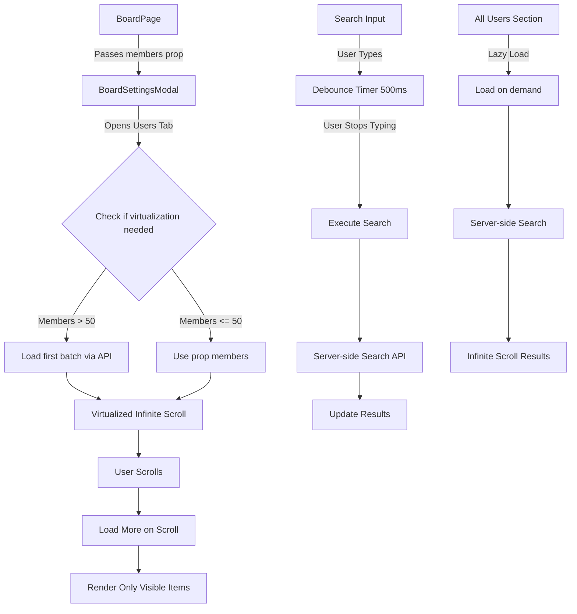

# Optimize Board Members Tab Performance

## Problem Statement

The board members tab in `BoardSettingsModal` has performance issues with 400+ members:

- Loads all users and members without pagination
- No virtualization - renders 400+ DOM nodes
- No debouncing - filters on every keystroke
- No memoization - recalculates filters on every render
- Refetches all members after each operation

## Scope

**In Scope:**

- Optimize `BoardSettingsModal` component (Users & Permissions tab)
- Add backend pagination support for members API (server-side only, no UI)
- Add frontend infinite scroll virtualization (no pagination UI)
- Add debounced search that waits until user finishes typing
- Add memoization for filtered results
- Optimize "All Users" section loading

**Out of Scope:**

- Changes to `BoardPage` member loading (kept as-is for backward compatibility)
- Changes to `BoardMembersDialog` (separate component)
- Changes to other tabs in `BoardSettingsModal`
- Changes to realtime subscriptions (already working)
- Pagination UI elements (buttons, page numbers, etc.)

## Architecture Overview




## Implementation Plan

### Phase 1: Backend API Enhancements

#### 1.1 Add Pagination to `getBoardMembers` Service

**File:** `backend/src/services/member.service.ts`

- Add optional `limit` and `offset` parameters to `getBoardMembers()` method
- Add optional `search` parameter for server-side filtering
- Return pagination metadata: `{ members, total, hasMore }`
- Maintain backward compatibility: if no pagination params, return all members (existing behavior)
```typescript
async getBoardMembers(
  userId: string, 
  boardId: string, 
  isAppAdmin: boolean,
  options?: { limit?: number; offset?: number; search?: string }
)
```


**Changes:**

- Lines 17-63: Modify method signature and query logic
- Add `take` and `skip` to Prisma query when options provided
- Add `where` clause for search filtering (email/fullName) when search provided
- Add count query for total when pagination requested
- Return `hasMore` boolean: `offset + limit < total`

#### 1.2 Update Members Route to Accept Pagination

**File:** `backend/src/routes/members.ts`

- Add query parameter parsing for `limit`, `offset`, `search`
- Pass options to `memberService.getBoardMembers()`
- Return paginated response format: `{ members, total, hasMore }`

**Changes:**

- Lines 10-18: Add query parameter extraction
- Pass options object to service method
- Return response with metadata

#### 1.3 Add Search Endpoint for All Users

**File:** `backend/src/routes/members.ts` (or create new route)

- Create endpoint: `GET /api/users/search?q=query&limit=50&offset=0`
- Search profiles table by email/fullName
- Return paginated results with `hasMore` flag
- Used by "All Users" section for server-side search

### Phase 2: Frontend Optimizations

#### 2.1 Add Virtualization Library

**File:** `package.json`

- Add `@tanstack/react-virtual` dependency (modern, better TypeScript support)
- Alternative: `react-window` if preferred
- Used for rendering only visible list items

#### 2.2 Create Debounced Search Hook

**File:** `src/hooks/useDebounce.ts` (new file)

- Create reusable `useDebounce` hook
- Default delay: **500ms** (wait for user to finish typing)
- Used for both member search and user search
- Only triggers search after user stops typing for 500ms
```typescript
export function useDebounce<T>(value: T, delay: number = 500): T {
  // Implementation that waits for delay before updating
}
```


#### 2.3 Optimize BoardSettingsModal Component

**File:** `src/components/kanban/BoardSettingsModal.tsx`**Changes:**

1. **State Management (Lines 109-118):**

- Add infinite scroll state: `loadedMembers`, `hasMoreMembers`, `loadingMore`
- Add search state: `memberSearchQuery` (raw) and `debouncedMemberSearch` (debounced)
- Add loading states: `loadingMembers`, `searchingMembers`
- Track if using infinite scroll mode (members.length > 50 or search active)

2. **Member Loading Logic (Lines 142-155):**

- Check if members prop has > 50 items OR if search is active
- If yes, switch to infinite scroll mode and load first batch (50 items) via API
- If no, use prop members (backward compatible)
- Load additional batches on scroll (when user scrolls near bottom)

3. **Search Implementation (Lines 238-255):**

- Use `useDebounce` for `memberSearchQuery` with 500ms delay
- **Critical:** Search only executes after user stops typing for 500ms
- When debounced search changes, clear current results and load from API
- Show "Searching..." indicator while waiting for debounce + API call
- If pagination mode: use server-side search via API
- If not: use client-side filtering (existing behavior for small lists)
- Memoize filtered results with `useMemo`

4. **Infinite Scroll Virtualized List (Lines 658-786):**

- Replace `.map()` rendering with virtualized infinite scroll list
- Use `@tanstack/react-virtual` for virtualization
- Render only visible items (20-30 at a time)
- Detect scroll position - when near bottom (80% scrolled), load next batch
- Show loading indicator at bottom while fetching more
- **No pagination UI** - only smooth infinite scroll

5. **All Users Section Optimization (Lines 529-641):**

- Lazy load: only fetch when "All Users" section is viewed or search is entered
- Use server-side search instead of loading all users
- Implement infinite scroll for search results
- Remove `fetchAllUsers()` on modal open (line 143-147)
- Only fetch when search query is entered (with debounce)
- Load more results on scroll

6. **Optimistic Updates:**

- After add/remove/update, update local state immediately
- Sync with server in background
- Avoid full refetch - only update affected member in current view
- If member is not in current view, append to list

#### 2.4 Add Memoization

**File:** `src/components/kanban/BoardSettingsModal.tsx`

- Wrap `filteredMembers` calculation in `useMemo` (depends on loadedMembers, debouncedMemberSearch)
- Wrap `filteredNonMembers` calculation in `useMemo` (depends on loadedUsers, debouncedSearchQuery, memberIds)
- Memoize `memberIds` Set creation
- Memoize `adminCount` calculation
- Memoize virtual list item renderer

### Phase 3: Performance Optimizations

#### 3.1 Reduce Re-renders

- Use `React.memo` for member list items (if using custom component)
- Use `useCallback` for event handlers (addMember, removeMember, updateRole, loadMore)
- Avoid unnecessary state updates
- Only update state when data actually changes

#### 3.2 Optimize API Calls

- Batch member operations when possible
- Cache loaded member data in component state
- Only refetch when necessary (not after every operation)
- Use optimistic updates to avoid refetch delays

#### 3.3 Loading States

- Show skeleton loaders during initial load
- Show subtle loading indicator at bottom during infinite scroll
- Show "Searching..." indicator during debounce + search
- No pagination buttons or page numbers

## File Changes Summary

### Backend Files

1. `backend/src/services/member.service.ts` - Add pagination to `getBoardMembers()` with hasMore flag
2. `backend/src/routes/members.ts` - Add query parameter support for limit/offset/search
3. `backend/src/routes/boards.ts` - (Optional) Add user search endpoint

### Frontend Files

1. `src/components/kanban/BoardSettingsModal.tsx` - Main optimization changes
2. `src/hooks/useDebounce.ts` - New debounce hook (500ms delay)
3. `package.json` - Add @tanstack/react-virtual dependency

## Key Requirements

1. **No Pagination UI:** Only infinite scroll - no page numbers, no "Next/Previous" buttons
2. **Infinite Scroll:** Load more members automatically when user scrolls near bottom
3. **Debounced Search:** Wait 500ms after user stops typing before executing search
4. **Virtualization:** Only render visible items (20-30 at a time) for performance
5. **Backward Compatible:** Small boards (< 50 members) work exactly as before

## Backward Compatibility

- **BoardPage integration:** Members prop still works - if < 50 members and no search, use prop directly
- **API compatibility:** Backend returns all members if no pagination params (existing behavior)
- **Realtime updates:** Continue to work - update local state optimistically
- **Permission checks:** No changes to permission logic

## Testing Considerations

1. **Small boards (< 50 members):** Should work exactly as before, no infinite scroll
2. **Large boards (400+ members):** Should load first 50 quickly, load more on scroll
3. **Search:** Should wait 500ms after typing stops, then show results
4. **Scroll:** Should smoothly load more members when scrolling down
5. **Add/Remove/Update:** Should update UI immediately, sync in background
6. **Realtime:** Should still receive and display updates correctly

## Performance Targets