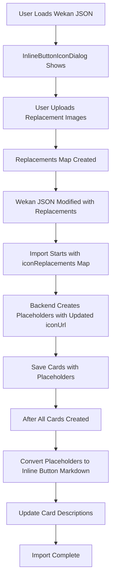

# Post-Import Placeholder-Based Inline Button Conversion

## Problem

The current implementation converts inline button placeholders to markdown during import, but doesn't use the icon replacements from the pre-import InlineButtonIconDialog. We need to pass replacement iconUrls to the backend so placeholders contain the correct image URLs, then automatically convert placeholders to inline buttons after import completes.

## Solution Overview

1. **Frontend**: Existing `InlineButtonIconDialog` continues to work - user uploads replacement images before import
2. **Frontend**: Pass `iconReplacements` map (original /cdn URL -> replacement URL) to backend import endpoint
3. **Backend**: Accept `iconReplacements` parameter in import route and service
4. **Backend**: When creating placeholders, use replacement iconUrl from map if available (otherwise use original)
5. **Backend**: Create placeholders with embedded metadata including updated iconUrl
6. **Backend**: After all cards are created, automatically convert placeholders to `[INLINE_BUTTON:base64data]` markdown using stored metadata

## Implementation Details

### 1. Pass Icon Replacements to Backend (Frontend)

**File**: [`src/components/import/BoardImportDialog.tsx`](src/components/import/BoardImportDialog.tsx)

**Change**: Update `proceedWithImport` to pass `iconReplacements` map to backend (around line 1013). Need to check how `importWekanWithStreaming` calls the backend API and add `iconReplacements` to the request body.

### 2. Accept Icon Replacements in Backend Route

**File**: [`backend/src/routes/board-import.ts`](backend/src/routes/board-import.ts)

**Change**: Update schema and pass to service (around line 17):

```typescript
const importBoardSchema = z.object({
  wekanData: z.any(),
  defaultCardColor: z.string().nullable().optional(),
  iconReplacements: z.record(z.string(), z.string()).optional(), // Map of original URL -> replacement URL
}).passthrough();

// Around line 136:
const { wekanData, defaultCardColor, iconReplacements } = validated;

// Pass to service (around line 162 and 218):
await boardImportService.importWekanBoard(
  authReq.userId!,
  wekanData,
  defaultCardColor || null,
  sendProgress,
  sendResult,
  iconReplacements || {} // Add as parameter
);
```

### 3. Accept Icon Replacements in Import Service

**File**: [`backend/src/services/board-import.service.ts`](backend/src/services/board-import.service.ts)

**Change**: Update `importWekanBoard` method signature (around line 316):

```typescript
async importWekanBoard(
  userId: string,
  wekanData: any,
  defaultCardColor: string | null,
  sendProgress?: (update: ProgressUpdate) => void,
  sendResult?: (result: ImportResult) => void,
  iconReplacements?: Record<string, string> // Add parameter
): Promise<ImportResult>
```

### 4. Modify Placeholder Creation to Use Replacements

**File**: [`backend/src/services/board-import.service.ts`](backend/src/services/board-import.service.ts)

**Change**: Update `convertInlineButtonsToPlaceholders` function signature and logic (around line 30):

```typescript
function convertInlineButtonsToPlaceholders(
  description: string | null | undefined,
  wekanCardId: string,
  iconReplacements?: Record<string, string> // Add parameter
): { processedDescription: string | null; buttons: InlineButtonPlaceholderData[] } {
  // ... existing code ...
  
  const processedDescription = description.replace(wekanButtonRegex, (match, innerHtml) => {
    // ... existing extraction code ...
    
    if (anchorMatch) {
      const originalIconUrl = imgMatch?.[1] || '';
      // Use replacement URL if available, otherwise use original
      const finalIconUrl = iconReplacements?.[originalIconUrl] || originalIconUrl;
      
      // Create button metadata with updated iconUrl
      const buttonMetadata = {
        iconUrl: finalIconUrl,
        linkUrl: anchorMatch[1] || '',
        linkText: (anchorMatch[2]?.replace(/<[^>]*>/g, '') || 'Button').trim(),
        textColor: textColorMatch?.[1]?.trim() || '#579DFF',
        backgroundColor: bgColorMatch?.[1]?.trim() || '#1D2125',
        iconSize: 16,
      };
      
      // Encode metadata as base64
      const encodedMetadata = Buffer.from(JSON.stringify(buttonMetadata)).toString('base64');
      const placeholder = `[INLINE_BUTTON_PLACEHOLDER:${wekanCardId}:${buttonIndex}:${encodedMetadata}]`;
      
      buttons.push({
        wekanCardId,
        buttonIndex,
        iconUrl: finalIconUrl, // Store updated iconUrl
        linkUrl: anchorMatch[1] || '',
        linkText: (anchorMatch[2]?.replace(/<[^>]*>/g, '') || 'Button').trim(),
        textColor: textColorMatch?.[1]?.trim() || '#579DFF',
        backgroundColor: bgColorMatch?.[1]?.trim() || '#1D2125',
      });
      
      buttonIndex++;
      return placeholder;
    }
    
    return match;
  });
  
  // ... rest of function ...
}
```

**Change**: Update call site (around line 577):

```typescript
const { processedDescription, buttons } = convertInlineButtonsToPlaceholders(
  wekanCard.description,
  wekanCard._id,
  iconReplacements // Pass replacements map
);
```

### 5. Update Placeholder-to-Markdown Conversion

**File**: [`backend/src/services/board-import.service.ts`](backend/src/services/board-import.service.ts)

**Change**: Update the batch conversion section (lines 659-743) to decode metadata from placeholders and convert to inline button markdown. The placeholder format is `[INLINE_BUTTON_PLACEHOLDER:wekanCardId:buttonIndex:base64data]`, so we need to match this pattern and replace with `[INLINE_BUTTON:base64data]` using the metadata already stored in the placeholder.

## Data Flow



## Key Implementation Points

1. **Placeholder Format**: `[INLINE_BUTTON_PLACEHOLDER:wekanCardId:index:base64data]`

   - `wekanCardId`: Original Wekan card ID (mapped to new card ID when replacing)
   - `index`: Button index within card
   - `base64data`: Base64-encoded JSON of button metadata (includes updated iconUrl from replacements)

2. **Icon Replacement Flow**:

   - Frontend `InlineButtonIconDialog` creates replacement map: `Map<originalUrl, replacementUrl>`
   - Map is passed to backend as `iconReplacements: Record<string, string>`
   - Backend uses replacement URL when creating placeholder metadata if original URL exists in map
   - Placeholder contains final iconUrl (either replacement or original)

3. **Metadata Structure**: Matches `InlineButtonData` interface:
   ```typescript
   {
     iconUrl: string; // Already has replacement URL if applicable
     linkUrl: string;
     linkText: string;
     textColor: string;
     backgroundColor: string;
     iconSize: number;
   }
   ```

4. **Automatic Conversion**: After all cards are created, placeholders are automatically converted to `[INLINE_BUTTON:base64data]` markdown using the metadata stored in placeholders.

5. **Error Handling**: If placeholder conversion fails, log warning but don't fail import. Placeholders remain in descriptions for manual editing.

6. **Backward Compatibility**: Existing `[INLINE_BUTTON:base64data]` format continues to work. Only new imports use placeholders.

## Testing Considerations

- Test with Wekan exports containing multiple inline buttons per card
- Test with buttons containing /cdn image URLs that get replaced via InlineButtonIconDialog
- Test with buttons containing external image URLs (no replacement needed)
- Verify replacement iconUrls are correctly used in placeholder metadata
- Verify placeholders are automatically converted to inline button markdown after import
- Test error handling if placeholder conversion fails
- Test import flow when no icon replacements are provided (iconReplacements is empty or undefined)