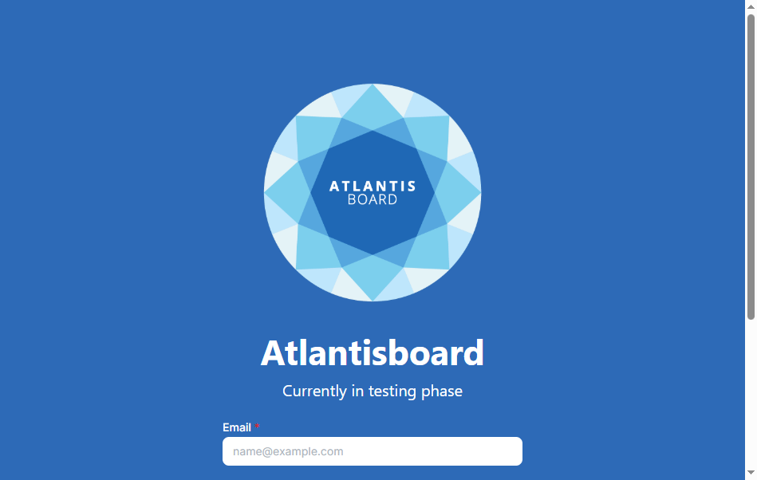

# Signing in, accounts, and recovery

[← Wiki home](Home.md)

How you sign in depends on **how your server was set up**. Your admin might allow email and password, Google, or both. The sign-in page only shows what is enabled.

---

## Email and password

1. Open your site’s sign-in page (often something like your company URL with a login path — your admin will tell you the exact address).  
2. Enter **email** and **password**.  
3. Optional **Remember me** keeps you signed in longer on that browser (still respect shared computers).  
4. Use **Sign up** if self-registration is allowed — you pick a display name, email, and password.  
5. **Forgot password** starts a reset flow if your server sends email for that (some installs might not have mail configured yet).

---

## Google sign-in

If a **Continue with Google** (or similar) button appears, use it. You finish on Google’s site, then land back in Atlantisboard already signed in.

---

## Email verification and password reset

- **Verify email** — follow the link from your invitation or registration email when the app asks you to confirm your address.  
- **Reset password** — use the link from the “forgot password” email and choose a new password on the reset screen.

If emails never arrive, ask your admin to check spam folders and mail settings on the server.

---

## After you sign in

You normally land on the **home hub** (workspaces and boards). If someone sent you an **invite link**, you might bounce through a short “accept invite” screen first.

---

## Signing out

Open your **avatar menu** (top corner when you are logged in) and choose **Log out**.

---

## First user on a brand-new server

On a fresh install, the **first person to register** often becomes the **app administrator** automatically. That person can open admin settings and finish configuring the site for everyone else.

Next: [Home screen](home-and-workspaces.md).
