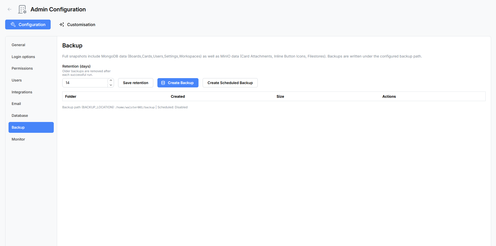

# Backup & Restore

The **Backup & Restore** panel lets you protect your Atlantisboard data with full-system backups. Each backup creates a ZIP archive containing a complete MongoDB database dump and a mirror of all MinIO storage buckets (attachments, branding assets, avatars, fonts, and backgrounds).

Navigate to **Admin → Backup** to open the panel.



---

## Backup Location

The backup destination is configured via the `BACKUP_LOCATION` environment variable. This must be an **absolute filesystem path** on the server host where backup ZIP archives will be stored.

The configured path is displayed read-only at the top of the panel. If no backup location is set, the panel will prompt you to configure the environment variable before any backup features are available.

```
BACKUP_LOCATION=/data/backups
```

> **Docker users:** Ensure the backup path is mapped to a Docker volume or bind mount so backups persist outside the container. See [Environment Variables Reference](environment-variables.md) for details.

---

## Retention

The **Retention** setting controls how long old backups are kept before being automatically purged.

| Setting | Range | Description |
|---------|-------|-------------|
| **Retention (days)** | 1–3 650 | Number of days to keep backup archives. Backups older than this are deleted during scheduled cleanup. |

Retention is persisted separately from the environment variables and can be adjusted at any time from this panel.

---

## Manual Backup

Click the **Create Backup** button to start a one-off backup immediately.

1. A modal appears with a **custom filename** field — enter a descriptive name for this backup (e.g. `pre-upgrade-2026-05-26`).
2. Confirm to start the backup process.
3. A progress indicator appears while the backup runs, showing the current phase and percentage.

### What's Included in a Backup

Each backup ZIP archive contains:

- **Full MongoDB database dump** — BSON exports of all collections in the database.
- **MinIO bucket mirror** — A complete copy of all object storage buckets:
  - `card-attachments` — files attached to cards.
  - `branding` — login and app branding assets (logos, favicons, backgrounds).
  - `user-avatars` — user profile pictures.
  - `fonts` — uploaded custom font files.
  - `import-inline` — temporary import staging files.

Backup ZIP files themselves are written to **`BACKUP_LOCATION`** on the server filesystem (not to a MinIO bucket).

---

## Scheduled Backups

Automated backups run on a configurable schedule so you never have to remember to back up manually.

1. Click **Create Scheduled Backup**.
2. Set the **frequency** — a number between 1 and 3 650 representing the interval in days between backups.
3. Save the schedule.

The panel displays the current schedule status:

| Status | Display |
|--------|---------|
| **Active** | "Every **N** day(s)" with the configured interval. |
| **Disabled** | "Disabled" — no scheduled backups are running. |
| **Last Run** | Timestamp of the most recent scheduled backup. |

Scheduled backups use the same format and contents as manual backups. They respect the retention setting — backups older than the configured retention period are automatically purged.

---

## Backup History

A table at the bottom of the panel lists all existing backup archives.


| Column | Description |
|--------|-------------|
| **Folder / Filename** | The backup archive name and its unique folder ID. |
| **Created** | The date and time the backup was created. |
| **Size** | The file size of the ZIP archive. |
| **Actions** | Restore or Delete buttons. |

---

## Restoring from a Backup

The restore process replaces your entire database and MinIO storage with the contents of a backup archive.


### Restore Flow

1. Locate the backup you want to restore in the **Backup History** table.
2. Click the **Restore** button.
3. A confirmation modal appears. To prevent accidental restores, you must type the **exact folder ID** of the backup archive into the confirmation field.
4. Click **Confirm Restore** to begin.
5. A **progress bar** appears showing the restore phase and completion percentage as data is imported.

### Restore Phases

The progress bar cycles through several phases during restoration:

1. **Extracting** — Unpacking the ZIP archive.
2. **Restoring database** — Importing BSON collections back into MongoDB.
3. **Restoring storage** — Mirroring bucket contents back into MinIO.
4. **Finalising** — Verifying data integrity and restarting services.

> **Warning:** Restoring a backup is a destructive operation. All current data in the database and MinIO storage is replaced with the backup contents. Create a fresh backup of your current state before restoring an older one, in case you need to revert.

---

## Deleting a Backup

Click the **Delete** button next to any backup in the history table to permanently remove the archive from disk. A confirmation prompt appears before the file is deleted.

---

## Backup Job Polling

While a backup or restore is in progress, the panel polls the server for status updates. A progress indicator displays:

- The **current phase** of the operation (e.g. "Dumping database", "Mirroring buckets").
- A **percentage** showing how much of the operation is complete.

You can navigate away from the panel while a backup is running — the job continues in the background. Return to the Backup panel to check progress or view the completed backup in the history table.

---

## Best Practices

- **Set a backup location early** — configure `BACKUP_LOCATION` during [initial setup](initial-configuration.md) before you start creating boards.
- **Enable scheduled backups** — even a weekly schedule (every 7 days) provides a safety net against data loss.
- **Test your backups** — periodically restore a backup to a staging environment to verify archive integrity.
- **Monitor disk space** — backup archives can grow large, especially with many card attachments. Use the [System Monitor](admin-monitor.md) to track disk usage.
- **Adjust retention** — set a retention period that balances storage costs with your recovery requirements.

---

## Related Pages

- [Environment Variables Reference](environment-variables.md) — `BACKUP_LOCATION`, `BACKUP_MC_PATH`, and `BACKUP_MC_MIRROR_ALIAS` settings.
- [Database Maintenance](admin-database.md) — clean up orphaned data before creating a backup.
- [System Monitor](admin-monitor.md) — monitor disk usage and system health.
- [Updating & Maintenance](updating.md) — always back up before upgrading.
