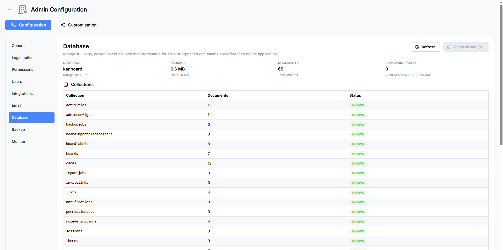

# Database Maintenance

The **Database Maintenance** panel provides a window into the health of your MongoDB database. Use it to review storage statistics, inspect collections, and clean up orphaned or expired records that accumulate over time.

Navigate to **Admin → Database** to open the panel.

---

## Statistics Grid

A read-only summary at the top of the panel displays key database metrics at a glance:

| Metric | Description |
|--------|-------------|
| **Database Name** | The name of the active MongoDB database (typically `kanboard`). |
| **MongoDB Version** | The version of the connected MongoDB server. |
| **Storage Size (MB)** | Total disk space consumed by the database. |
| **Total Documents** | The sum of documents across all collections. |
| **Collection Count** | The total number of collections in the database. |
| **Removable (Safe) Count** | The number of documents that can be safely removed using the cleanup tools below. |

---

## Unknown Collections

If the database contains collections that are not part of the Atlantisboard schema, they are flagged with informational badges. These may be leftover from previous versions, third-party tools, or manual database operations. Unknown collections are displayed for awareness but cannot be modified from this panel.

---

## Collections Table

Below the statistics grid, a table lists every collection in the database:

| Column | Description |
|--------|-------------|
| **Name** | The collection name. |
| **Document Count** | The number of documents in the collection. |
| **Status** | Either **Known** (part of the Atlantisboard schema) or **Unknown** (not recognised). |

---

## Manual Cleanup

Atlantisboard provides 16 cleanup categories to help you remove stale, expired, or orphaned data. Each category targets a specific type of record and includes a **Clean** button that removes matching documents.

### Cleanup Categories

| # | Category | What It Removes |
|---|----------|-----------------|
| 1 | **Stale Import Jobs** | Import job records that are no longer in progress and have exceeded their retention period. |
| 2 | **Stale Backup Jobs** | Backup job records that are no longer active. |
| 3 | **Expired Sessions** | User sessions that have passed their expiry time. |
| 4 | **Expired Notifications** | Notifications that have exceeded their retention period. |
| 5 | **Orphan Lists** | Lists whose parent board no longer exists in the database. |
| 6 | **Orphan Cards (no board or no list)** | Cards that reference a board or list that no longer exists. |
| 7 | **Orphan Labels** | Labels whose parent board no longer exists. |
| 8 | **Orphan Boards** | Boards whose parent workspace no longer exists. |
| 9 | **Orphan Activities (no board or no card)** | Activity log entries that reference a board or card that no longer exists. |
| 10 | **Orphan Import Placeholders** | Placeholder user records from board imports that are no longer associated with any board. |
| 11 | **Orphan Invite Links** | Board invite links whose parent board no longer exists. |
| 12 | **Orphan Notifications (no user)** | Notifications whose target user no longer exists. |
| 13 | **Orphan Notifications (no board)** | Notifications that reference a board that no longer exists. |
| 14 | **Orphan Notifications (no card)** | Notifications that reference a card that no longer exists. |
| 15 | **Orphan Import Jobs (no user)** | Import job records whose initiating user no longer exists. |
| 16 | **Orphan Checklists** | Checklist records whose parent card no longer exists. |

Each category displays a count of matching documents before you run the cleanup, so you can review the scope of the operation.

---

## Clean All Safe

The **Clean All Safe** button at the bottom of the cleanup section runs every safe cleanup category in a single batch operation. This is a convenient way to perform routine maintenance without clicking each category individually.

> **Note:** "Safe" means these operations only remove records that are already orphaned or expired — they do not touch active boards, cards, users, or any data that is still referenced by other documents. No active user data is affected.

---

## Refresh

Click the **Refresh** button to reload the statistics grid, collections table, and cleanup counts. This is useful after running cleanup operations to verify the results.

---

## Best Practices

- **Run cleanup periodically** — Orphaned records accumulate naturally as boards, cards, and users are deleted. A monthly cleanup keeps the database lean.
- **Check before cleaning** — Review the document counts for each category before clicking Clean. If a count looks unexpectedly high, investigate before proceeding.
- **Back up first** — For peace of mind, create a [backup](admin-backup.md) before running large cleanup operations.
- **Monitor storage** — Use the statistics grid to track storage growth over time. If storage is growing faster than expected, check for large collections or excessive activity logs.

---

## Related Pages

- [Backup & Restore](admin-backup.md) — create a backup before performing database maintenance.
- [System Monitor](admin-monitor.md) — monitor overall system health including database size.
- [Environment Variables Reference](environment-variables.md) — database-related configuration.
