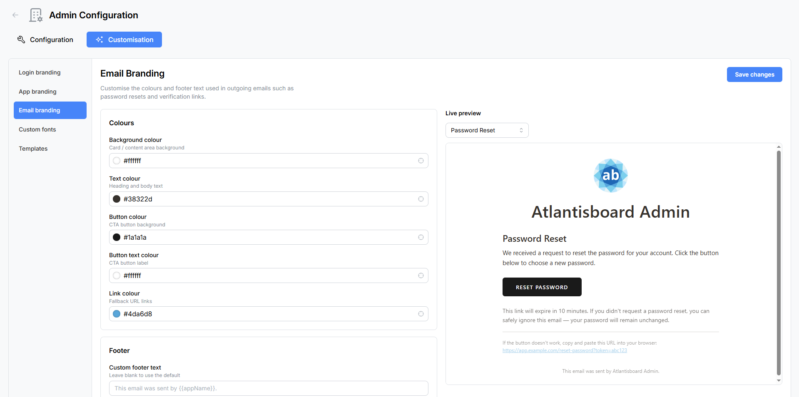

# Email Branding

The **Email Branding** panel lets you customise the visual appearance of all outgoing emails sent by Atlantisboard — including password reset links, email verification messages, and board invitation notifications. A live preview shows exactly how your branded emails will look.

Navigate to **Admin → Customisation → Email Branding** to open the panel.



---

## Live Preview

The right side of the panel displays a **live preview** of a rendered email template. A **template selector** at the top of the preview lets you switch between different email types to see how your colour choices look in context:

- Password reset email
- Email verification email
- Board invitation email


The preview updates in real-time as you adjust colours and footer text.

---

## Colours

The **Colours** card provides five colour pickers that control the key visual elements of every outgoing email.

| Setting | Type | Default | Description |
|---------|------|---------|-------------|
| **Background colour** | Colour picker | `#f2efe5` | The outer background colour of the email body. |
| **Text colour** | Colour picker | `#38322d` | The primary text colour used for headings and body copy. |
| **Button colour** | Colour picker | `#1a1a1a` | The background colour of call-to-action buttons (e.g. "Reset Password", "Verify Email"). |
| **Button text colour** | Colour picker | `#ffffff` | The text colour inside call-to-action buttons. |
| **Link colour** | Colour picker | `#4da6d8` | The colour of hyperlinks within the email body. |

These colours are applied consistently across all email templates, ensuring a unified brand appearance regardless of the email type.

---

## Footer

The **Footer** card lets you add a custom footer line that appears at the bottom of every outgoing email.

| Setting | Type | Description |
|---------|------|-------------|
| **Footer text** | Text input | A custom message displayed in the email footer. Supports the `{{appName}}` placeholder variable, which is automatically replaced with your application name at send time. |

### Using the `{{appName}}` Placeholder

The `{{appName}}` variable is replaced with the application name configured in [Login Branding](admin-login-branding.md). This keeps your emails consistent with your branding without hardcoding the name.

**Example input:**

```
Sent by {{appName}} — Your project management companion.
```

**Example output (if app name is "Team Boards"):**

```
Sent by Team Boards — Your project management companion.
```

If no custom app name is configured, `{{appName}}` falls back to "Atlantisboard".

---

## Saving Changes

Click **Save Changes** to persist your email branding settings. Changes apply to all future outgoing emails immediately. Previously sent emails are not affected.

---

## Tips

- **Test your branding** — after saving, send a test email from the [Email (SMTP) Configuration](admin-email.md) panel to see your branded template in a real email client.
- **Check dark mode** — many email clients render emails differently in dark mode. Test your colour choices in both light and dark email clients.
- **Keep contrast high** — ensure your text colour has sufficient contrast against the background colour for readability. Similarly, button text should be clearly legible against the button background.
- **Keep the footer concise** — email footers that are too long can look cluttered, especially on mobile devices.

---

## Related Pages

- [Email (SMTP) Configuration](admin-email.md) — configure your SMTP server and send test emails.
- [Login Branding](admin-login-branding.md) — set the app name used by the `{{appName}}` placeholder.
- [App Branding](admin-app-branding.md) — customise the in-app navbar and homepage.
