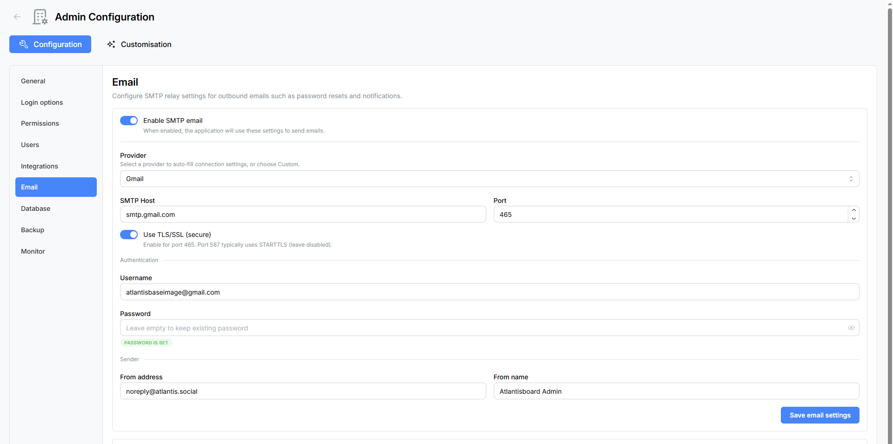

# Email (SMTP) Configuration

Atlantisboard uses outbound email for several critical workflows: password resets, email verification during registration, and board invitation notifications. Without a working SMTP configuration, these features will be unavailable.

Navigate to **Admin → Email** to configure your mail server.

---

## Enable SMTP Email

A master **Enable SMTP Email** toggle sits at the top of the panel. When disabled, all outbound email functionality is turned off and the configuration fields below are hidden.

---

## SMTP Provider Presets

Atlantisboard includes preconfigured presets for popular email services. Selecting a provider automatically fills in the host, port, and TLS settings, so you only need to enter your credentials.

| Provider | Host | Port | Secure (TLS) |
|----------|------|------|---------------|
| **Custom** | *(you configure)* | *(you configure)* | *(you configure)* |
| **Gmail** | `smtp.gmail.com` | `587` | Yes |
| **Mailgun** | `smtp.mailgun.org` | `587` | Yes |
| **Postmark** | `smtp.postmarkapp.com` | `587` | Yes |
| **SES** (Amazon) | `email-smtp.<region>.amazonaws.com` | `587` | Yes |
| **SendGrid** | `smtp.sendgrid.net` | `587` | Yes |
| **Brevo** | `smtp-relay.brevo.com` | `587` | Yes |

Select **Custom** if your mail server is not listed, then fill in the host, port, and TLS fields manually.

---

## Configuration Fields

| Field | Type | Default | Description |
|-------|------|---------|-------------|
| **SMTP Host** | Text | *(from preset)* | The hostname of your SMTP server. |
| **SMTP Port** | Number (1–65 535) | `587` | The port your SMTP server listens on. Common values: `587` (STARTTLS), `465` (implicit TLS), `25` (unencrypted — not recommended). |
| **Secure (TLS/SSL)** | Toggle | On | Enable TLS encryption for the SMTP connection. |
| **Username** | Text | — | SMTP authentication username. |
| **Password** | Password | — | SMTP authentication password. A badge indicates when a password is already stored on the server. |
| **From Address** | Email | — | The email address that appears in the "From" field of outgoing messages (e.g. `noreply@example.com`). |
| **From Name** | Text | — | The display name shown alongside the from address (e.g. `Atlantisboard`). |

After filling in all fields, click **Save** to persist the configuration.

> **Note:** The SMTP password is stored encrypted on the server. If you need to update it, enter the new password and save. A "Replace credentials" badge confirms when an existing password is already stored.

---

## Send Test Email

The **Send Test Email** section lets you verify your SMTP configuration before relying on it for production workflows.

1. Enter a **recipient email address** in the test field.
2. Click **Send Test Email**.
3. Atlantisboard sends a short test message using the saved SMTP settings.
4. Check the recipient's inbox (and spam folder) to confirm delivery.

If the test fails, an error message is displayed with details about what went wrong. See the troubleshooting section below.

---

## Troubleshooting

### Connection Refused

- Verify the **SMTP Host** and **Port** values are correct.
- Ensure your server's firewall allows outbound connections on the configured port.
- If running inside Docker, confirm the container can reach the external SMTP server (check DNS resolution and network policies).

### Authentication Failed

- Double-check the **Username** and **Password**.
- For Gmail, you must use an [App Password](https://support.google.com/accounts/answer/185833) rather than your regular Google account password (2FA must be enabled).
- For SES, ensure the IAM user has `ses:SendEmail` and `ses:SendRawEmail` permissions.
- For SendGrid, the username is typically `apikey` and the password is your API key.

### TLS Handshake Error

- Confirm the **Secure** toggle matches your server's expectations — port `587` typically uses STARTTLS, while port `465` uses implicit TLS.
- If your server uses a self-signed certificate, you may need to configure your environment to trust it.

### Emails Land in Spam

- Ensure your sending domain has valid **SPF**, **DKIM**, and **DMARC** DNS records.
- Use a recognisable **From Name** and **From Address**.
- Avoid sending from generic addresses like `test@localhost`.

---

## Related Pages

- [Login Options](admin-login-options.md) — enable mandatory email verification for new registrations.
- [Password Reset & Email Verification](password-reset.md) — how password reset emails work.
- [Email Branding](admin-email-branding.md) — customise the look and feel of outgoing emails.
- [Environment Variables Reference](environment-variables.md) — SMTP-related environment variables.
