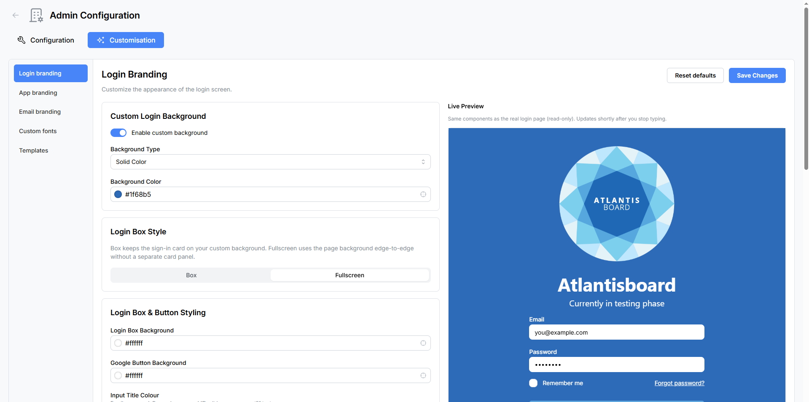

# Login Branding

The **Login Branding** panel lets you fully customise the appearance of the login and registration pages. Every change is reflected in a live preview so you can see exactly how your login page will look before saving.

Navigate to **Admin → Customisation → Login Branding** to open the panel.

---

## Live Preview

The left side of the panel displays a **real-time preview** of the login page. It uses the same components as the actual login screen, rendered in a read-only state. The preview updates shortly after you stop typing or changing a setting, so you can experiment freely.

---

## Custom Login Background

Control the background behind the login form.

| Setting | Type | Default | Description |
|---------|------|---------|-------------|
| **Enable custom background** | Toggle | Off | When disabled, the default background is used. |
| **Background type** | Selector | Solid Colour | Choose between **Solid Colour** and **Gradient**. |
| **Background colour** | Colour picker | `#1f68b5` | The primary background colour (used for both solid and gradient start). |
| **Gradient end colour** | Colour picker | `#e7f5ff` | The secondary colour for gradient backgrounds. Only visible when **Gradient** is selected. |

---

## Login Box Style

Choose the overall layout of the login form.

| Option | Description |
|--------|-------------|
| **Box** | The login form is displayed inside a centered card with rounded corners and a shadow. |
| **Fullscreen** | The login form fills the entire viewport without a card container. |

This is a segmented control — click the option you prefer.

---

## Login Box & Button Styling

Fine-tune the colours of every element within the login form.

| Setting | Type | Default | Description |
|---------|------|---------|-------------|
| **Login box background** | Colour picker | `#ffffff` | Background colour of the login card (Box layout only). |
| **Google button background** | Colour picker | `#ffffff` | Background colour of the "Sign in with Google" button. |
| **Google button text** | Colour picker | `#000000` | Text colour of the Google sign-in button. |
| **Input title colour** | Colour picker | `#495057` | Colour of form field labels (e.g. "Email", "Password"). |
| **Link title colour** | Colour picker | `#228be6` | Colour of text links (e.g. "Forgot password?", "Create account"). |
| **Sign-in button colour** | Colour picker | `#228be6` | Background colour of the primary sign-in button. |
| **Sign-in button text** | Colour picker | `#ffffff` | Text colour of the sign-in button. |

---

## Custom Login Logo

Display your organisation's logo on the login page.

| Setting | Type | Description |
|---------|------|-------------|
| **Enable logo** | Toggle | Show or hide the logo on the login page. |
| **Upload logo** | File upload | Accepted formats: PNG, JPEG, WebP, SVG. Maximum file size: 5 MB. |
| **Logo size** | Selector | Choose from predefined pixel sizes to control how large the logo appears. |
| **Remove logo** | Button | Delete the uploaded logo and revert to no logo. |

The logo is displayed with a **circular crop** on the login page, positioned above the login form.

---

## Custom App Name

Display your application's name prominently on the login page.

| Setting | Type | Default | Description |
|---------|------|---------|-------------|
| **Enable app name** | Toggle | Off | Show or hide the app name on the login screen. |
| **Application name** | Text input | — | The name to display (e.g. "My Company Board"). |
| **Font family** | Selector | System UI | Choose from System UI or any [uploaded custom fonts](admin-custom-fonts.md). |
| **Font size** | Selector | — | Options: 32, 36, 40, 44, 48, or 56 px. |
| **Colour** | Colour picker | `#1f68b5` | Text colour of the app name. |

---

## Custom Tagline

Add a short subtitle or description below the app name.

| Setting | Type | Default | Description |
|---------|------|---------|-------------|
| **Enable tagline** | Toggle | Off | Show or hide the tagline. |
| **Tagline text** | Text input | — | The tagline to display (e.g. "Organise. Collaborate. Deliver."). |
| **Font family** | Selector | System UI | Choose from System UI or any uploaded custom fonts. |
| **Font size** | Selector | — | Options: 14, 16, 18, 20, 22, or 24 px. |
| **Colour** | Colour picker | `#868e96` | Text colour of the tagline. |

---

## Browser Tab & Favicon

Customise the browser tab title and favicon for the entire application.

| Setting | Type | Description |
|---------|------|-------------|
| **Enable custom tab title** | Toggle | Override the default browser tab title. |
| **Tab title** | Text input | The custom title shown in the browser tab. |
| **Enable custom favicon** | Toggle | Override the default Atlantisboard favicon. |
| **Upload favicon** | File upload | Accepted formats: PNG, ICO, SVG, WebP. Maximum file size: 512 KB. |

---

## Saving and Resetting

- **Save Changes** — Persists all current settings. The live login page updates immediately for all users.
- **Reset Defaults** — Opens a confirmation modal, then restores all Login Branding settings to their factory defaults. This removes uploaded logos, favicons, and all colour customisations.

---

## Related Pages

- [App Branding](admin-app-branding.md) — customise the in-app navbar and homepage appearance.
- [Email Branding](admin-email-branding.md) — customise outgoing email templates.
- [Custom Fonts](admin-custom-fonts.md) — upload fonts for use in branding selectors.
