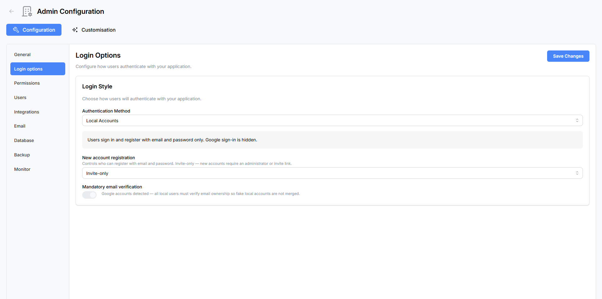
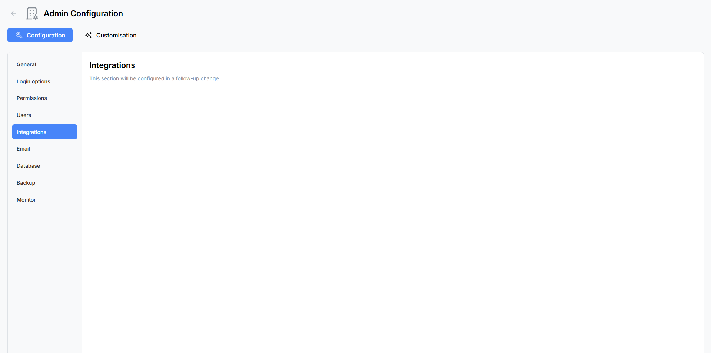

# Admin: Login Options

The Login Options panel controls how users authenticate with Atlantisboard and how new accounts are created. This is one of the first settings you should configure after creating your [first admin account](first-admin-account.md).

---

## Accessing Login Options

1. Sign in as an **App Admin**.
2. Open the **Admin Configuration** panel from the navigation menu.
3. Select the **Login Options** tab.

---

## Login Style Card

The Login Style card contains the core authentication and registration settings that control the user-facing login experience.



### Authentication Method

Choose how users sign in to Atlantisboard. The selected method determines which login controls appear on the login page and which additional configuration cards are shown below.

| Method | Description |
|--------|-------------|
| **Local Accounts** | Email and password authentication only. Users create accounts with an email, username, and password. This is the simplest setup with no external dependencies. |
| **Local Accounts + Google** | Both local password and Google OAuth sign-in are available. Users can choose either method. If a local account exists with the same email as a Google account, the identities are linked automatically. |
| **Google Login Only** | Users sign in exclusively through Google. No local password accounts are created. All users must have a Google account. |
| **Google Login + Database Verification** | Google sign-in with an additional verification step: after Google authenticates the user, their email is checked against an external MySQL database using a configurable SQL query. Only users whose email passes the query are allowed in. |

> **Tip:** Start with "Local Accounts" if you want the simplest setup. You can always switch to a Google-enabled method later.

### Registration Mode

Control whether new users can create accounts:


| Mode | Behaviour |
|------|-----------|
| **Open Registration** | Anyone who visits the login page can create an account. A "Sign Up" link is visible on the login page. |
| **Invite Only** | New users can only register through a valid invite link shared by an existing board member. The public sign-up link is hidden. |
| **Disabled** | No new accounts can be created. Only existing users can sign in. The registration page is not accessible. |

> **Note:** Regardless of this setting, the [first-user bypass](first-admin-account.md) always allows registration when the database has zero users.

### Mandatory Email Verification

Toggle whether new users must verify their email address before they can sign in.

When **enabled**:
- After registering, users see a "Check your email" screen.
- A verification link is sent to the user's email (requires [SMTP to be configured](#)).
- The verification token expires after **10 minutes**. Users can click "Resend" to get a new link.
- Users cannot access the application until their email is verified.

When **disabled**:
- Users can sign in immediately after registration without verifying their email.

> **Important:** Mandatory email verification is **automatically forced on** when Google OAuth is configured alongside local accounts (the "Local Accounts + Google" method). This prevents account impersonation — it ensures that a local account's email actually belongs to the person before a Google identity can be linked to it.

---

## Google OAuth Configuration Card

This card appears when the selected authentication method includes Google sign-in (any method except "Local Accounts").



### Setting Up Google OAuth

1. Go to the [Google Cloud Console](https://console.cloud.google.com/apis/credentials).
2. Create a new OAuth 2.0 Client ID (Web application type).
3. Add your authorised redirect URI: `https://your-domain.com/api/v1/auth/google/callback`
4. Copy the **Client ID** and **Client Secret**.
5. Paste them into the corresponding fields in Atlantisboard.

### Configuration Fields

| Field | Description |
|-------|-------------|
| **Client ID** | Your Google OAuth client ID. Stored encrypted on the server using your `ENCRYPTION_KEY`. |
| **Client Secret** | Your Google OAuth client secret. Stored encrypted on the server. |
| **Callback URL** | The OAuth redirect path. Defaults to `/api/v1/auth/google/callback`. You typically do not need to change this unless your application is mounted at a subpath. |

### Updating Credentials

If you need to change your OAuth credentials (e.g. rotating secrets or switching Google Cloud projects), click the **"Replace credentials"** button. This clears the stored credentials and lets you enter new ones.

> **Note:** The Client ID and Client Secret are encrypted at rest using AES-256-GCM with your `ENCRYPTION_KEY` environment variable. They are never exposed in plaintext through the API or admin panel after saving.

### LAN / Private IP Setup

If your Atlantisboard instance is accessible only on a local network (not a public domain), Google requires additional parameters for the OAuth flow. Set these in your `.env` file:

```ini
GOOGLE_OAUTH_DEVICE_ID=your-device-id
GOOGLE_OAUTH_DEVICE_NAME=your-device-name
GOOGLE_OAUTH_BROWSER_ORIGIN=http://192.168.1.10:3000
```

See the [Environment Variables Reference](environment-variables.md) for details.

---

## External Database Configuration Card

This card appears **only** when the authentication method is set to **"Google Login + Database Verification"**. It configures the external MySQL database used to verify whether a Google-authenticated user is allowed to access Atlantisboard.

### How It Works

1. A user clicks "Sign in with Google" and authenticates through Google.
2. Atlantisboard receives the user's email from Google.
3. The application runs a configurable SQL query against your external MySQL database, substituting the user's email into the query.
4. If the query returns one or more rows, the user is allowed in. If it returns zero rows, access is denied.

This is useful for organisations that maintain a staff directory or approved-users list in a MySQL database and want to gate Atlantisboard access accordingly.

### Configuration Fields

| Field | Description |
|-------|-------------|
| **Host** | MySQL server hostname or IP address |
| **Port** | MySQL server port (default: 3306) |
| **Database Name** | The MySQL database to query |
| **Username** | MySQL connection username |
| **Password** | MySQL connection password (stored encrypted) |
| **Verification SQL Query** | A `SELECT` statement with a `?` placeholder for the user's email. Example: `SELECT id FROM approved_users WHERE email = ?` |

### Actions

| Button | Description |
|--------|-------------|
| **Test Connection** | Attempts to connect to the MySQL database with the provided credentials. Reports success or the specific error. |
| **Save Configuration** | Saves the database connection details and verification query. Credentials are encrypted at rest. |
| **Replace credentials** | Clears the stored MySQL credentials and lets you enter new ones. |

### Example Verification Query

```sql
SELECT id FROM staff_directory WHERE email_address = ? AND status = 'active'
```

The `?` placeholder is replaced with the Google-authenticated user's email address. The query does not need to return any specific columns — only the row count matters (one or more rows = access granted).

> **Warning:** The verification query must be a read-only `SELECT` statement. Do not use `INSERT`, `UPDATE`, `DELETE`, or other data-modifying statements.

---

## Summary of Card Visibility

The cards shown on the Login Options page depend on the selected authentication method:

| Authentication Method | Login Style Card | Google OAuth Card | External DB Card |
|----------------------|:----------------:|:-----------------:|:----------------:|
| Local Accounts | Shown | Hidden | Hidden |
| Local Accounts + Google | Shown | Shown | Hidden |
| Google Login Only | Shown | Shown | Hidden |
| Google Login + DB Verification | Shown | Shown | Shown |

---

## See Also

- [First Admin Account](first-admin-account.md) — how the first user is created and promoted.
- [Initial Configuration Walkthrough](initial-configuration.md) — where Login Options fits in the setup process.
- [Environment Variables Reference](environment-variables.md) — Google OAuth and MySQL environment variables.
- [Permissions & Roles](admin-permissions.md) — controlling what users can do after they sign in.
