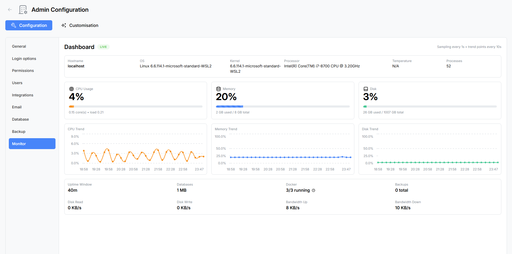

# System Monitor

The **System Monitor** is a real-time health dashboard that gives App Admins visibility into server performance, resource usage, and operational metrics. Data is streamed live via WebSocket, so the dashboard updates continuously without manual refreshing.

Navigate to **Admin → Monitor** to open the dashboard.



---

## Host Info Bar

A read-only information bar at the top of the dashboard displays static details about the server environment:

| Field | Description |
|-------|-------------|
| **Hostname** | The server's network hostname. |
| **OS** | Operating system name and version. |
| **Kernel** | Kernel version string. |
| **Processor** | CPU model name and architecture. |
| **Temperature** | CPU temperature reading (if available from the host). |
| **Process Count** | Total number of running processes on the host. |

---

## Usage Gauges

Three animated progress bar gauges provide an at-a-glance view of current resource utilisation:

### CPU Usage

- **Percentage** — Current CPU utilisation across all cores.
- **Cores** — Number of logical CPU cores available.
- **Load Average** — 1-minute, 5-minute, and 15-minute load averages.

### Memory

- **Percentage** — Current memory utilisation.
- **Used / Total** — Amount of memory in use versus total available memory.

### Disk

- **Percentage** — Current disk utilisation for the primary storage volume.
- **Used / Total** — Amount of disk space consumed versus total available.

Each gauge updates in real-time as new data arrives from the server.

---

## Trend Charts

Below the gauges, three line charts track resource usage over time, allowing you to spot patterns and anticipate capacity issues.


| Chart | Colour | Tracks |
|-------|--------|--------|
| **CPU Trend** | Orange | CPU utilisation percentage over time. |
| **Memory Trend** | Blue | Memory utilisation percentage over time. |
| **Disk Trend** | Teal | Disk utilisation percentage over time. |

Charts scroll as new data points are added, providing a rolling window of recent activity.

---

## Runtime Metrics Grid

A grid of read-only metric cards provides additional operational details:

| Metric | Description |
|--------|-------------|
| **Uptime** | How long the application has been running since the last restart, displayed in a human-readable format (e.g. "3d 14h 22m"). |
| **Databases** | Total size of all MongoDB databases on the connected server. |
| **Docker** | Number of running containers versus total containers. Hover or click to see a tooltip listing container names. |
| **Backups** | Total number of backup archives stored in the configured backup location. |
| **Disk Read** | Current disk read throughput in bytes per second. |
| **Disk Write** | Current disk write throughput in bytes per second. |
| **Bandwidth Up** | Current outbound network throughput in bytes per second. |
| **Bandwidth Down** | Current inbound network throughput in bytes per second. |

---

## Health Check Endpoint

Atlantisboard exposes a lightweight health check endpoint for external monitoring tools, load balancers, and container orchestrators:

```
GET /health
```

This endpoint returns a `200 OK` response when the application is running and can connect to its dependent services (MongoDB, Redis). Use it with Docker health checks, Kubernetes liveness probes, or uptime monitoring services like UptimeRobot or Pingdom.

---

## How It Works

The System Monitor collects metrics from the host operating system and application runtime, then streams them to connected admin clients via Socket.io WebSocket. This means:

- **No page refreshes needed** — data updates automatically in real-time.
- **Low overhead** — metrics are collected at a sensible interval and only broadcast to admin users viewing the monitor page.
- **Docker-aware** — when running inside Docker, the monitor reports container-level metrics where available and can enumerate running containers.

---

## Best Practices

- **Check before and after upgrades** — monitor system metrics during application updates to catch performance regressions early.
- **Watch disk trends** — a steadily rising disk trend chart may indicate that backups, attachments, or logs need attention.
- **Set up external monitoring** — while the built-in dashboard is convenient, consider pairing it with an external uptime monitor that polls the `/health` endpoint and alerts you if the application goes down.
- **Monitor memory after imports** — large board imports can temporarily spike memory usage. Watch the memory gauge during import operations.

---

## Related Pages

- [Backup & Restore](admin-backup.md) — check backup count and disk usage.
- [Database Maintenance](admin-database.md) — monitor database size and perform cleanup.
- [Environment Variables Reference](environment-variables.md) — server and logging configuration.
