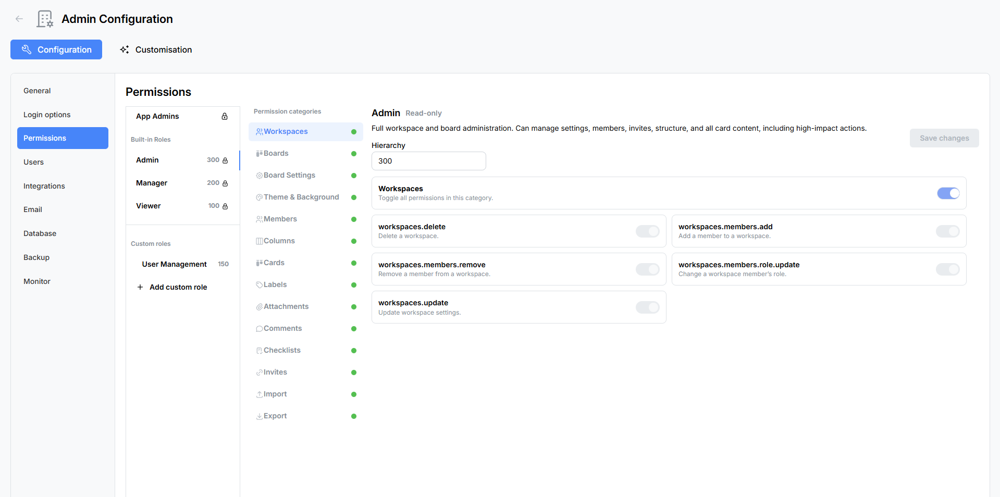

# Admin: Permissions & Roles

Atlantisboard uses a role-based access control (RBAC) system with hierarchy levels to control what users can do across workspaces and boards. This page covers the App Admin panel, built-in roles, custom role creation, permission categories, and the hierarchy mode for role assignment.

---

## Accessing Permissions & Roles

1. Sign in as an **App Admin**.
2. Open the **Admin Configuration** panel from the navigation menu.
3. Select the **Permissions & Roles** tab.

---

## App Admins

The top section of the Permissions & Roles panel is the **App Admins** sub-panel. App Admins are global administrators who can access the Admin Configuration panel and manage all aspects of the application.

### Managing App Admins

- **Grant App Admin access**: use the user search field to find a user by name or email, then promote them.
- **Revoke App Admin access**: remove the App Admin flag from an existing admin (you cannot remove your own admin status).

App Admin privileges are separate from board-level roles. A user can be an App Admin without being a member of any particular board, and vice versa.

> **Note:** The [founding admin](first-admin-account.md) (first registered user) is permanently flagged but can still have their App Admin status revoked by another admin if needed.

---

## Built-in Roles

Atlantisboard ships with three built-in roles. These roles cannot be deleted or renamed, but their permissions can be viewed.

### Admin

The board-level Admin role grants full control over a workspace and its boards:

- Create, edit, and delete boards
- Manage all board settings (card settings, list settings, labels, themes, backgrounds)
- Add and remove members, change roles
- Create and manage invite links
- Import and export boards
- All card, list, label, comment, checklist, and attachment operations

### Manager

The Manager role is designed for day-to-day board operations with some administrative constraints:

- Create and manage cards, lists, and labels
- Manage comments, checklists, and attachments
- Limited board settings access
- Cannot change certain high-level board or workspace settings
- Role assignment constrained by the hierarchy system

### Viewer

The Viewer role is a read-only collaboration role:

- View boards, lists, cards, and their details
- View comments and activity
- Cannot create, edit, or delete any content
- Cannot manage members or settings

---

## Custom Roles

In addition to the three built-in roles, you can create custom roles tailored to your organisation's needs.

### Creating a Custom Role

1. Click the **"Add Role"** button.
2. Enter a **name** for the role (e.g. "Team Lead", "Contributor", "Guest").
3. Enter a **description** explaining the role's purpose.
4. Set the **hierarchy level** — a numeric value that determines which other roles this role can assign. Higher numbers can assign roles with the same or lower hierarchy levels (depending on the hierarchy mode).
5. Configure the permission toggles for each of the 15 categories.
6. Save the role.

### Editing a Custom Role

Click on an existing custom role to edit its name, description, hierarchy level, or permissions. Changes take effect immediately for all users assigned to that role.

### Deleting a Custom Role

Custom roles can be deleted if they are no longer needed. A confirmation modal appears before deletion. Users currently assigned the deleted role will need to be reassigned to another role.

---

## Permission Categories

Atlantisboard organises permissions into **15 categories**. Each category contains individual permission toggles, and every category has a **tri-state "toggle all" control**:

- **All on** — every permission in the category is enabled.
- **All off** — every permission in the category is disabled.
- **Mixed** — some permissions are on, some are off (indeterminate state).

### The 15 Categories

| # | Category | What It Controls |
|---|----------|-----------------|
| 1 | **Workspaces** | Create, edit, delete, and manage workspaces |
| 2 | **Boards** | Create, edit, delete, and manage boards |
| 3 | **Board Settings** | Access and modify board-level settings (card settings, list settings, etc.) |
| 4 | **Theme & Background** | Change board themes, apply custom themes, modify board backgrounds |
| 5 | **Members** | Add/remove board members, view member lists, change member roles |
| 6 | **Columns** | Create, rename, reorder, and delete lists (columns) |
| 7 | **Cards** | Create, edit, move, reorder, and delete cards; manage card dates, colours, and covers |
| 8 | **Labels** | Create, edit, and delete labels; add/remove labels from cards |
| 9 | **Attachments** | Upload, download, and delete card attachments |
| 10 | **Comments** | Add, edit, and delete comments on cards |
| 11 | **Checklists** | Create, edit, and delete checklists and checklist items |
| 12 | **Invites** | Create, view, and delete board invite links |
| 13 | **Import** | Import boards from external formats (Trello, Wekan, CSV, Atlantisboard JSON) |
| 14 | **Export** | Export boards to external formats (CSV, Trello JSON, Wekan JSON, Atlantisboard JSON) |
| 15 | **Other** | Miscellaneous permissions not covered by the above categories |

Each category expands to show its individual permission toggles. For example, the **Cards** category includes separate toggles for creating cards, editing card titles, moving cards between lists, reordering cards within a list, editing start/due/end dates, deleting cards, and more.

---

## Member Role Update Hierarchy Mode

The hierarchy mode controls which roles a user can assign to other board members. This prevents privilege escalation — for example, ensuring a Manager cannot promote someone to Admin.

Each role has a numeric **hierarchy level**. The hierarchy mode setting determines how this level is used when a user tries to change another member's role:

| Hierarchy Mode | Rule |
|---------------|------|
| **Same only** | A user can only assign roles at the same hierarchy level as their own |
| **Lower only** | A user can only assign roles at a lower hierarchy level than their own |
| **Higher only** | A user can only assign roles at a higher hierarchy level than their own |
| **Same or higher** | A user can assign roles at the same level or higher |
| **Same or lower** | A user can assign roles at the same level or lower |
| **Any** | A user can assign any role regardless of hierarchy level |

### How It Works in Practice

Consider three roles with these hierarchy levels:
- Admin: level 100
- Manager: level 50
- Viewer: level 10

With the **"Lower only"** hierarchy mode:
- An Admin (100) can assign Manager (50) or Viewer (10) to other users.
- A Manager (50) can assign Viewer (10) to other users, but cannot assign Admin (100) or Manager (50).
- A Viewer (10) cannot assign any roles.

> **Tip:** For most organisations, **"Same or lower"** is a sensible default. It allows admins and managers to assign roles at their own level or below, preventing accidental privilege escalation.

---

## Permission Behaviour

### How Permissions Are Evaluated

- Each user on a board has exactly **one role**.
- The role's permissions determine what the user can do on that board.
- **App Admins** bypass all board-level permission checks — they have full access to every board.
- **Board owners** (the user who created the board) have a special non-editable "Owner" designation that grants full access.

### Permission Gating in the UI

When a user lacks a specific permission:
- Restricted buttons and controls are either hidden or disabled.
- Attempting a restricted action via the API returns a 403 Forbidden response.

### Real-Time Permission Updates

Permission changes take effect in real time. When an admin changes a role's permissions or reassigns a user's role, the affected user's UI updates immediately via Socket.io — no page refresh required.

---

## Best Practices

- **Start with built-in roles** — Admin, Manager, and Viewer cover most use cases. Only create custom roles when you need granular control.
- **Use descriptive names** — name custom roles after their function (e.g. "External Contributor", "Project Lead") rather than generic labels.
- **Set hierarchy levels thoughtfully** — leave gaps between levels (e.g. 10, 50, 100) to allow adding intermediate roles later without renumbering.
- **Review permissions periodically** — as your team's workflow evolves, revisit role configurations to ensure they match current needs.
- **Use the "Same or lower" hierarchy mode** as a sensible default to prevent privilege escalation.

---

## See Also

- [First Admin Account](first-admin-account.md) — how the founding App Admin is created.
- [Login Options](admin-login-options.md) — controlling who can register and how they authenticate.
- [Initial Configuration Walkthrough](initial-configuration.md) — where Permissions & Roles fits in the setup process.
