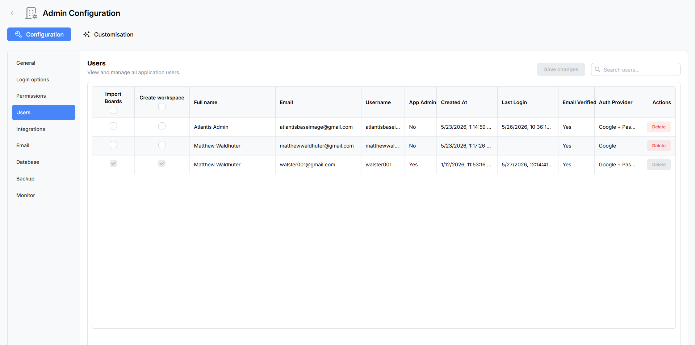

# User Management

The **User Management** panel gives App Admins a complete view of every registered account. From here you can search and sort users, toggle per-user capabilities, promote or demote administrators, lock compromised accounts, and permanently delete users who should no longer have access.

Navigate to **Admin → User Management** to open the panel.

---

## User List

All registered users are displayed in a searchable, sortable table. Use the search field at the top of the table to filter by name, email, or username.

### Columns Displayed

| Column | Description |
|--------|-------------|
| **Import Boards** | Checkbox — grants the user permission to import boards from external sources (Trello®, WeKan®, CSV, Atlantisboard JSON). |
| **Create Workspace** | Checkbox — grants the user permission to create new workspaces on the home page. |
| **Full Name** | The user's display name. |
| **Email** | The user's registered email address. |
| **Username** | The user's unique username. |
| **App Admin** | Badge indicating whether the user holds global App Admin privileges. |
| **Created At** | Timestamp of when the account was registered. |
| **Last Login** | Timestamp of the user's most recent successful sign-in. |
| **Email Verified** | Whether the user has completed email verification. |
| **Auth Provider** | The authentication method used — *Local* (email/password) or *Google* (OAuth). |
| **Actions** | Per-user action buttons (see below). |

Each capability column header includes a **master checkbox** that toggles the capability for all users at once.

---

## Per-User Capabilities

Two capability flags can be toggled independently for each user:

- **Import Boards** — When enabled, the user can access the import workflow from the home page and upload board files. When disabled, the import option is hidden for that user.
- **Create Workspace** — When enabled, the user can create new workspaces. When disabled, the "Create Workspace" button is hidden.

These checkboxes are edited inline in the table. Changes are not saved automatically — you must click the **Save** button to persist them (see [Batch Save](#batch-save) below).

---

## Actions

Each user row includes an **Actions** column with the following options:

### Promote / Demote App Admin

- **Promote** — Elevates a regular user to App Admin status. App Admins have access to the full Admin Configuration panel, can manage all workspaces and boards, and can modify global settings.
- **Demote** — Revokes App Admin privileges from an administrator. The founding admin (the first user ever registered) cannot be demoted.

### Lock / Unlock Account

- **Lock** — Immediately prevents the user from signing in. Useful for compromised accounts or policy violations. Locked users see an "account locked" message when they attempt to log in.
- **Unlock** — Restores sign-in access for a previously locked account. This also clears any automatic lockout triggered by consecutive failed login attempts.

### Delete User

- Permanently removes the user's account and disassociates them from all boards and workspaces.
- A confirmation modal appears before deletion to prevent accidental removal.
- Deleted users cannot be recovered — if they need access again, they must register a new account.

> **Caution:** Deleting a user removes their membership from every board and workspace. Cards they created or are assigned to will retain their content, but the user reference will be cleared.

---

## Batch Save

Capability changes (Import Boards and Create Workspace toggles) are collected in the browser and submitted together when you click the **Save** button at the bottom of the panel. This allows you to adjust multiple users in a single operation without triggering a network request for every checkbox change.

If you navigate away from the page before saving, unsaved capability changes are discarded.

---

## Tips

- Use the **search field** to quickly locate users in large deployments.
- Click any **column header** to sort the table by that column.
- The **App Admin** badge updates immediately after promoting or demoting a user — no page refresh is required.
- Account lockouts triggered by three consecutive failed login attempts can be cleared from this panel using the **Unlock** action. See [Password & Security](user-security.md) for details on the lockout policy.
- For more information on configuring which roles users can be assigned on boards, see [Permissions & Roles](admin-permissions.md).
