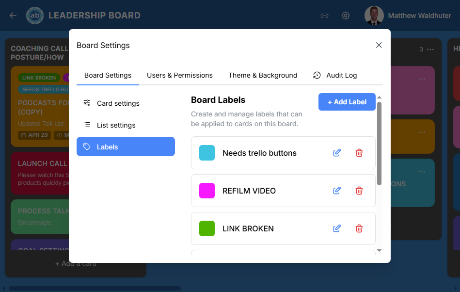

# Making a board yours: look, defaults, and members

[← Wiki home](Home.md)

**Board settings** are for one board at a time. **Admin configuration** (different place) is for the entire site — see [Admin configuration](admin-configuration.md).

Open **Board settings** from the board header when you have access. On phones the same content may appear as **steps** instead of one giant panel.

---

## What you can usually change

**Board tab**

- **Card settings** — defaults for new cards on this board (what is turned on out of the gate).  
- **List settings** — limits and behaviour for lists (for example how many cards feel comfortable before warning).  
- **Labels** — create, rename, recolor, and delete labels for this board.

**People tab**

- See **members** and their roles.  
- Invite or remove people if you are allowed.  
- Search for users the same way as assignees: type, press **Enter** to pick from results.

**Look and feel**

- **Theme and background** — pick a preset look or a custom theme if your admin allows custom themes.  
- Some installs let you open a **theme editor** with a live preview on the board while you tweak colors.

**Activity**

- **Audit / activity log** — who changed what on this board (visibility depends on role).

---

## Invites (separate small window)

Besides settings, boards often have a dedicated **Invites** action in the header. That flow is only about bringing people in, not about colors or defaults.

---

## Permissions in one sentence

If a tab or button is missing, your **role** on that board does not include it — ask a board admin to bump your access or perform the change for you.

Next: [Collaboration and invites](collaboration-and-invites.md).
