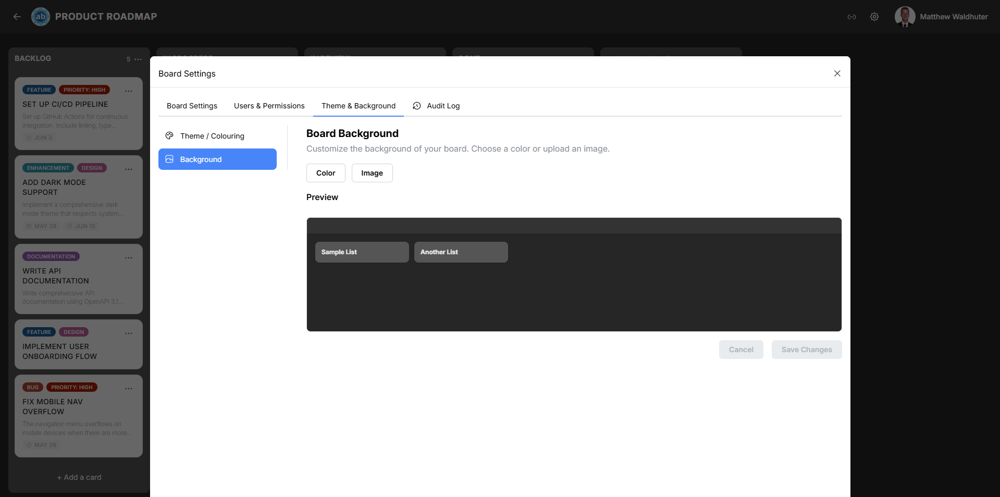

# Background

The Background sub-panel gives you control over what appears behind your board's lists and cards. Choose a simple colour, rely on the active theme's canvas colour, or upload a custom image with intelligent positioning.

---

## Accessing the Background Panel

1. Open a board and click the **gear icon** in the board navbar.
2. Navigate to the **Theme & Background** tab.
3. Select the **Background** sub-panel.

---

## Background Mode Selector

Three modes are available:

### Theme

Uses the canvas background colour defined by the currently active [theme](board-settings-theme.md). This is the default mode — the board background automatically matches your theme palette without any additional configuration.

### Colour

Overrides the theme's background with a custom solid colour of your choice. A colour picker lets you select any colour value.

### Image

Upload a custom background image that fills the board canvas. This mode unlocks additional positioning and scaling options.

---

## Image Upload

When Image mode is selected, you can upload a background image:

1. Click the upload area or drag-and-drop an image file.
2. Supported formats: PNG, JPEG, WebP.
3. The image is stored in the MinIO object storage backend.

### Smart Focal-Point Detection

Atlantisboard uses `smartcrop` to automatically detect the most visually important region of your image. This focal point influences how the image is positioned and cropped, ensuring the most meaningful part of the photo remains visible regardless of the board's viewport size.

---

## Image Scale Modes

When an image background is active, choose how it fills the board area:

| Mode | Behaviour |
|------|-----------|
| **Fill** | Scales the image to completely cover the board area. Parts of the image may be cropped depending on the aspect ratio. |
| **Fit** | Scales the image to fit entirely within the board area while maintaining aspect ratio. Letterboxing may appear on the sides or top/bottom. |
| **Fit Top-Left** | Fits the image within the board area but anchors it to the top-left corner instead of centering. |
| **Smart Fill** | Uses the detected focal point to intelligently crop and position the image, keeping the subject in view while filling the entire area. |

Choose the mode that best suits your image composition:

- Use **Fill** for abstract textures or patterns where cropping doesn't matter.
- Use **Fit** when you want the entire image visible.
- Use **Smart Fill** for photographs with a clear subject (people, objects, landmarks).

---

## Board Opacity Slider

The opacity slider controls the transparency of the board's navbar and list columns when rendered over a background image. This lets the background show through while keeping content readable.

| Setting | Effect |
|---------|--------|
| **1.0** (maximum) | Fully opaque — the navbar and list columns are solid, completely hiding the background behind them. |
| **0.1** (minimum) | Nearly transparent — the background is highly visible through the board elements. |

Adjust the slider to find the right balance between background visibility and content readability. A value between 0.7 and 0.9 works well for most photographs.

> **Tip:** The opacity slider primarily affects boards using image backgrounds. If your background mode is Theme or Colour, the slider has minimal visual effect since the background is a solid colour.

---

## Deleting a Background Image

When an image is uploaded, a **Delete** button appears allowing you to remove the current background image. After deletion, the board reverts to the previously selected mode (Theme or Colour).

---

## Related Pages

- [Theme & Colouring](board-settings-theme.md) — Select and manage the board's colour theme.
- [Themes Overview](themes.md) — Learn about the full theming system.
- [Custom Theme Editor](theme-editor.md) — Create themes with custom canvas background colours.
