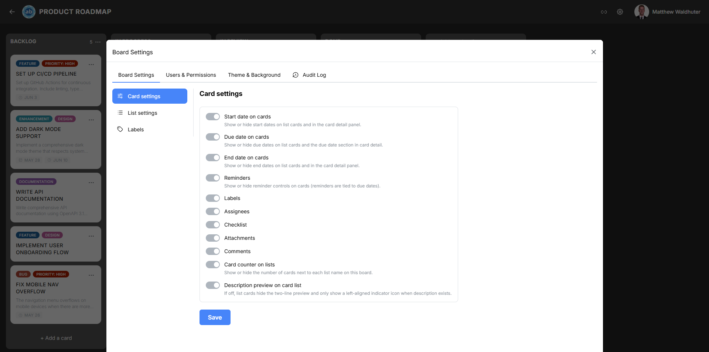

# Board Settings: Card Settings

The Card Settings panel lets you control which metadata elements are visible on card previews across the board. This allows you to tailor the board's information density to your team's needs — show everything for detailed tracking, or hide elements for a cleaner, more focused view.

---

## Accessing Card Settings

1. Open a board.
2. Click the **gear icon** (settings) in the board navbar.
3. Navigate to the **Board Settings** tab.
4. Locate the **Card Settings** sub-panel.

---

## Card Metadata Toggles

Each toggle controls whether a specific piece of information appears on card preview tiles across all lists on the board. Changes take effect immediately and are synced to all connected users in real time.

### Date Toggles

| Toggle | Description |
|--------|-------------|
| **Start date on cards** | Show or hide start date badges on card previews. When visible, the start date appears with a calendar icon. |
| **Due date on cards** | Show or hide due date badges. Due dates use status colours (upcoming, overdue, complete) for quick visual scanning. |
| **End date on cards** | Show or hide end date badges. End dates indicate when work was completed. |

### Feature Toggles

| Toggle | Description |
|--------|-------------|
| **Reminders** | Show or hide reminder controls and indicators on cards. When enabled, cards with active reminders display a bell icon. |
| **Labels** | Show or hide label colour chips on card previews. When hidden, labels are still assigned to cards — they simply are not displayed on the board view. |
| **Assignees** | Show or hide assignee avatars on card previews. Up to 4 avatars are shown, with a `+N` overflow indicator for additional assignees. |
| **Checklist** | Show or hide the checklist progress indicator (completed/total items) on card previews. |
| **Attachments** | Show or hide the attachment count indicator (paperclip icon with count). |
| **Comments** | Show or hide the comment count indicator (speech-bubble icon with count). |

### List and Description Toggles

| Toggle | Description |
|--------|-------------|
| **Card counter on lists** | Show or hide the card count badge in list headers. Useful for monitoring workload distribution at a glance. |
| **Description preview on card list** | Controls how card descriptions are indicated on the board. When enabled, a 2-line text preview of the description is shown on each card. When disabled, only a small icon indicates that a description exists. |

---

## Card Size

The card size selector controls the visual footprint of card tiles on the board:

| Size | Description |
|------|-------------|
| **Small** | Compact cards with minimal padding. Best for boards with many cards where screen real estate is at a premium. |
| **Medium** | Standard-sized cards with more spacing for badge elements. Better readability at the cost of fewer visible cards. |

---

## Default Card Colour

Set a default background colour for newly created cards on this board. Individual cards can still have their colour overridden from the [Card Detail](card-detail.md) modal or the card context menu.

---

## How Toggles Affect the Board

- **Hiding an element** does not remove the underlying data — it only hides it from the board view. For example, turning off "Labels" does not remove labels from cards; it just stops displaying them on previews.
- **All users** on the board see the same toggle settings. Card Settings are board-level, not per-user.
- **Changes are instant** — toggling a setting immediately updates all card previews across all connected clients.

---

## Related Pages

- [Cards](cards.md) — card preview anatomy and what each badge element means.
- [Card Detail](card-detail.md) — editing card properties in the detail modal.
- [Board Settings: List Settings](board-settings-list.md) — configuring list-level options like width and WIP limits.
- [Board Overview](board-overview.md) — the board layout where these settings take effect.
