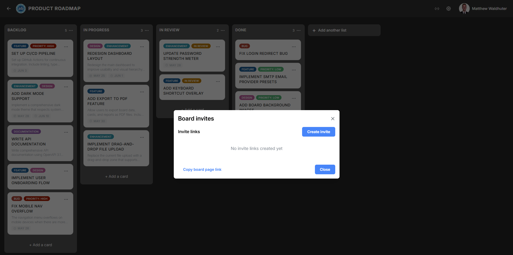

# Invites & Sharing

The Invites system provides a convenient way to share board access with others by generating invite links. Recipients can join the board directly by visiting the link — no manual admin action required.

---

## Accessing the Invites Modal

The Invites modal is accessible from the **Invites** button on the board navbar. This button is visible to users who have the `invites.view` permission in their role.

---

## Quick Board Link

At the top of the Invites modal, you can **copy the board page link** — a direct URL to the board. This is useful for sharing with users who already have board membership and simply need the link.

---

## Creating an Invite Link

Users with the `invites.create` permission can generate new invite links:

1. Click **Create Invite Link**.
2. Configure the invite:

| Option | Description |
|--------|-------------|
| **Invite type** | **One-time** — The link can only be used once, then it expires. **Recurring** — The link can be reused by multiple people. |
| **Default role** | The role automatically assigned to anyone who joins via this link (e.g. Member, Observer). |

3. Click **Create**.

The generated link is displayed and ready to copy. Share it via email, messaging, or any other channel.

---

## Invite Link Behaviour

When someone visits an invite link:

- **Existing users** — If the visitor is logged in (or logs in after clicking), they are added to the board with the role specified in the invite.
- **New users** — If registration is set to invite-only, the invite link grants them permission to register. After registration, they are automatically added to the board.
- **One-time links** — Deactivated after a single successful use.
- **Recurring links** — Remain active indefinitely until manually deleted.

---

## Viewing Active Invite Links

The Invites modal displays a table of all active invite links for the board:

| Column | Description |
|--------|-------------|
| **Link** | The invite URL (click to copy). |
| **Type** | One-time or Recurring. |
| **Role** | The role assigned to invitees. |
| **Created** | When the link was generated. |

---

## Deleting an Invite Link

Users with the `invites.delete` permission can remove invite links:

1. Locate the link in the active invites table.
2. Click the **Delete** button next to it.
3. Confirm the deletion.

Once deleted, the link immediately stops working. Anyone who tries to use a deleted link will see an error message.

---

## Email Invites

In addition to link-based invites, you can invite users directly by email:

1. Enter one or more email addresses.
2. Select the role for invitees.
3. Send the invitation.

Recipients receive an email with a link to join the board. If they don't yet have an account, the email guides them through registration.

---

## Pending Invites

The modal also shows a list of **pending invites** — invitations that have been sent but not yet accepted. This helps administrators track who has been invited and follow up if needed.

---

## Real-Time Updates

Invite link creation and deletion propagate in real-time via Socket.io. If multiple administrators are managing invites simultaneously, changes appear instantly for all viewers.

---

## Permissions Summary

| Action | Required Permission |
|--------|-------------------|
| View invite links | `invites.view` |
| Create invite links | `invites.create` |
| Delete invite links | `invites.delete` |

---

## Related Pages

- [Users & Permissions](board-settings-users.md) — Manage board members and roles directly.
- [Permissions & Roles](admin-permissions.md) — Configure the global permission system including invite-related permissions.
- [Registration & Sign-In](accounts-auth.md) — How invite-only registration mode works.
