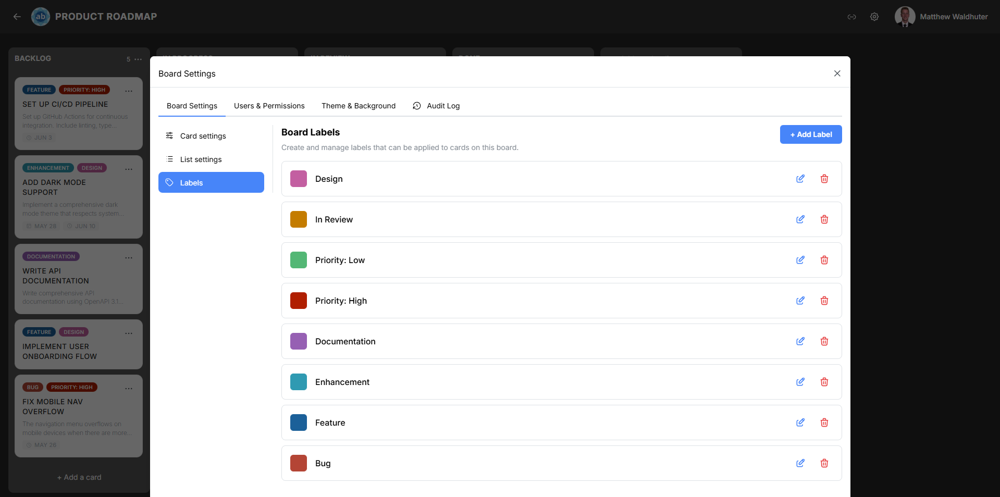

# Labels

Labels are colour-coded tags you attach to cards to categorise, prioritise, or visually group related work. Each board maintains its own independent set of labels, so you can tailor the label palette to suit the workflow of every project.

---

## Accessing Label Management

1. Open a board.
2. Click the **gear icon** in the board navbar to open Board Settings.
3. Navigate to the **Board Settings** tab → **Labels** sub-panel.

---

## Label Anatomy

Every label has two attributes:

| Attribute | Description |
|-----------|-------------|
| **Name** | An optional text label (e.g. "Bug", "Feature", "Urgent"). Labels can be colour-only with no name. |
| **Colour** | One of 18 built-in colour presets. |

---

## Built-in Label Colours

Atlantisboard ships with 18 carefully chosen label colours that ensure clear visual distinction on the board:

| Colour | Swatch |
|--------|--------|
| Red | Deep red |
| Orange | Warm orange |
| Amber | Rich amber/gold |
| Yellow | Bright yellow |
| Lime | Yellow-green lime |
| Green | Standard green |
| Teal | Blue-green teal |
| Cyan | Light cyan |
| Sky | Light sky blue |
| Blue | Standard blue |
| Indigo | Deep indigo |
| Violet | Medium violet |
| Purple | Rich purple |
| Fuchsia | Vibrant fuchsia |
| Pink | Soft pink |
| Rose | Deep rose |
| Slate | Cool grey (slate) |
| Zinc | Neutral grey (zinc) |

---

## Creating a Label

1. In the Labels sub-panel, click **Create Label** (or the **+** button).
2. Enter an optional label name.
3. Select a colour from the 18-colour preset palette.
4. Click **Save**.

The new label is immediately available for assignment to any card on this board.

---

## Editing a Label

1. In the label list, click the **edit** icon next to the label you want to modify.
2. Change the name, colour, or both.
3. Click **Save**.

All cards already using this label automatically reflect the updated name and colour — no need to re-apply.

---

## Deleting a Label

1. Click the **delete** icon next to the label.
2. Confirm the deletion in the dialog that appears.

> **Warning:** Deleting a label removes it from every card on the board. This action cannot be undone.

---

## Label Usage Across Cards

Labels assigned to cards appear in multiple places:

- **Board view** — Colour chips displayed on the card preview (when the "Labels" toggle is enabled in [Card Settings](board-settings-card.md)).
- **Card detail modal** — Full label names and colours in the Labels section.
- **Filter bar** — Filter cards by one or more labels to focus on a subset of work.

A single card can have multiple labels, and a single label can be applied to any number of cards.

---

## Real-Time Updates

Label changes propagate instantly to all connected users via Socket.io. When a team member creates, edits, or deletes a label, every board viewer sees the update without refreshing.

---

## Tips

- Use colour-only labels (no name) when you want a minimal visual indicator without extra text clutter.
- Establish a consistent colour convention across boards (e.g. red = critical, green = approved) so team members can quickly interpret card status.
- Combine labels with the board [filter bar](filtering-search.md) to view only cards matching specific categories.
