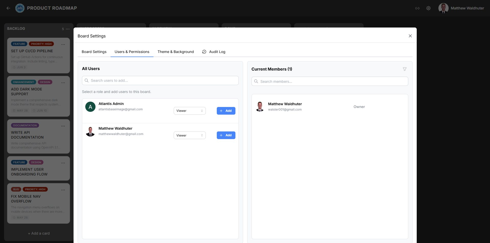

# Users & Permissions

The Users & Permissions tab lets board administrators control who can access the board and what they can do. Every board member has an assigned role that determines their permissions within that board.

---

## Accessing the Users & Permissions Tab

1. Open a board.
2. Click the **gear icon** in the board navbar to open Board Settings.
3. Select the **Users & Permissions** tab.

---

## Panel Layout

The tab uses a two-panel layout:

### Left Panel — All Users (Directory)

A searchable directory of all registered users in the application.

- **Search** — Type a name or email and press Enter to filter the list.
- **Role selector** — Choose the role to assign before adding a user to the board.
- **Add button** — Click to add the selected user to the board with the chosen role.
- **Discard all placeholder users** — Removes import placeholder users that were created during board imports.
- The list is paginated and virtualised for performance with large user bases.

### Right Panel — Current Members

The active member roster for this board.

- **Search** — Filter current members by name.
- **Role filter** — Filter by a specific role to see only members of that type.
- **Columns displayed:**
  - Avatar and display name
  - Role selector (dropdown to change the member's role)
  - Remove button (revokes board membership)

---

## Board Owner

The user who created the board (or was designated as owner) appears with a non-editable **Owner** role badge. The board owner cannot be removed or demoted through this interface.

---

## Available Roles

Atlantisboard provides three built-in roles plus any custom roles defined by your application administrator:

| Role | Description |
|------|-------------|
| **Admin** | Full control over the board — settings, members, all card operations. |
| **Member** | Day-to-day operations — create, edit, and move cards; manage labels and checklists. Constrained from modifying board settings and membership depending on hierarchy configuration. |
| **Observer** | Read-only access — view cards and comments, but cannot create or modify content. |

Custom roles created in the global [Permissions & Roles](admin-permissions.md) settings also appear in the role selector, each with their own configured permission set.

---

## Role Hierarchy

Role assignment respects the **hierarchy mode** configured in the global Permissions & Roles settings. This means:

- A member can only assign roles at or below their own hierarchy level (depending on the mode).
- The hierarchy modes include: Same only, Lower only, Higher only, Same or higher, Same or lower, and Any.
- This prevents privilege escalation — for example, a Manager cannot promote someone to Admin unless the hierarchy mode explicitly allows it.

---

## Adding a Member

1. In the left panel, search for the user you want to add.
2. Select the role to assign from the role dropdown above the user list.
3. Click the **Add** button next to the user's name.

The user immediately gains access to the board with the selected role.

---

## Changing a Member's Role

1. In the right panel, locate the member.
2. Click the role dropdown next to their name.
3. Select the new role.

The change takes effect immediately and is logged in the board's [Audit Log](board-settings-audit.md).

---

## Removing a Member

1. In the right panel, locate the member.
2. Click the **Remove** button (trash icon).
3. Confirm the removal if prompted.

Removed members lose all access to the board. Their existing contributions (cards, comments) remain intact but are attributed to their user record.

---

## Import Placeholder Users

When a board is imported from Trello®, WeKan®, or another Atlantisboard instance, users referenced in the imported data are created as **placeholder users**. These appear with special badges:

- **Imported** — The placeholder has been mapped to a real user.
- **Not Mapped** — The placeholder is still unclaimed.

When a real user registers with an email matching a placeholder, they are automatically claimed as a board member. You can also manually discard all placeholder users using the **Discard all placeholder users** button in the left panel.

---

## Searching Members

Both panels support real-time search:

- **Left panel** — Search the full user directory by name or email. Press Enter to execute the search.
- **Right panel** — Filter current board members by name using the search field.

---

## Related Pages

- [Invites & Sharing](board-settings-invites.md) — Invite new users via link or email.
- [Permissions & Roles](admin-permissions.md) — Configure the global role and permission system.
- [Audit Log](board-settings-audit.md) — Track member additions, removals, and role changes.
