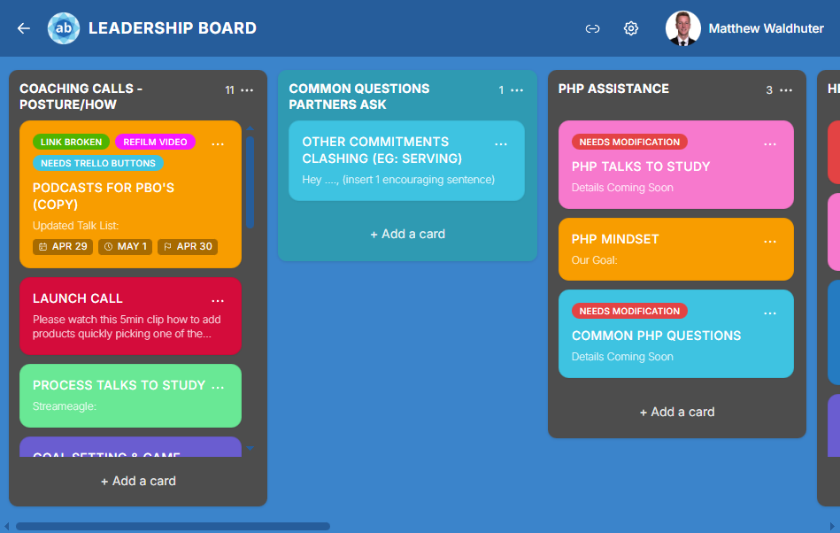

# Boards, lists, and cards

[← Wiki home](Home.md)

A **board** is the big working view: horizontal **lists** (columns) and **cards** inside each list.

---

## Lists (columns)

- Lists usually represent **stages** (Ideas, This week, Done) or **teams** — your choice.  
- **Add list** — there is typically a composer at the **far right** of the board; type a name and confirm.  
- You can **drag** a whole list sideways to reorder columns when you are allowed to.

---

## Cards

- **Add card** — each list has a short form at the bottom; type a **title** and submit.  
- **Open a card** — click the card. It opens as an **overlay** so you stay on the board underneath.  
- **Deep links** — some links open the board and automatically pop a specific card using the address bar; handy when someone pastes a link in chat.

---

## Drag and drop

- Drag a **card** up or down inside a list to reorder.  
- Drag a card **onto another list** to move it.  
- Empty lists still show a **drop zone** so you can move cards there without guessing.

On small screens, the board may switch to a **swipe between lists** style so you are not squinting at ten columns at once.

---

## Board header

Typical actions (only if your role allows):

- **Back** to home.  
- **Board settings** — lists, labels, theme, members, activity.  
- **Invites** — share links or invite people to this board.  
- **Avatar menu** — your profile, log out, and **Admin** entries if you are a site-wide admin.

---

## If you cannot see a board

You might see **Board not found** or get sent home. That means the link is wrong, the board was deleted, or you do not have access — ask a board admin to invite you or check the link.

Next: [Card details](card-details.md) or [Board look and settings](board-customisation.md).
