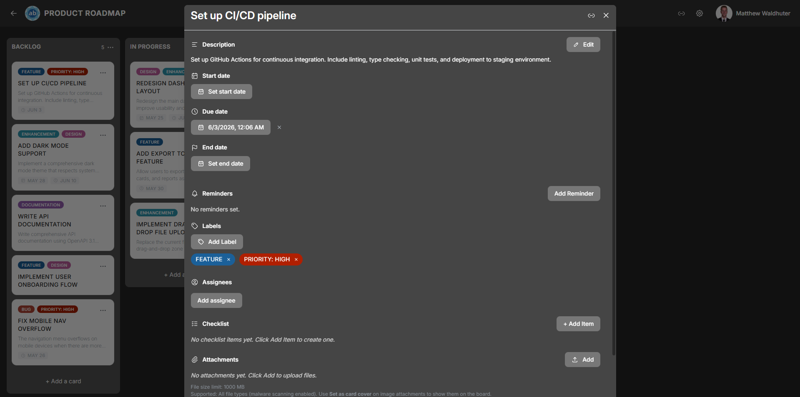

# Card Detail

The card detail modal is where you manage everything about a card. Open it by clicking any card on the board. The modal provides a comprehensive editing experience with sections for descriptions, dates, checklists, comments, attachments, and more.

---

## Title

The card title appears at the top of the modal. Click it to edit inline — type your changes and click away or press **Enter** to save. The title supports emoji rendering.

---

## Description

The description field uses a rich-text editor powered by **Tiptap** with full Markdown support.

### Formatting Options

The formatting toolbar includes:

- **Bold**, **italic**, **strikethrough**, and **underline**
- **Headings** (multiple levels)
- **Bullet lists** and **numbered lists**
- **Code** (inline) and **code blocks** with syntax highlighting (powered by Lowlight)
- **Links** — paste or type URLs
- **Emoji picker** — insert emoji directly into the text
- **Inline button extension** — add interactive button elements

The editor saves automatically. Other users see description changes reflected in real time.

---

## Dates

Cards support three independent date fields, each with a date and time picker:

| Date Field | Permission Gate | Purpose |
|------------|-----------------|---------|
| **Start Date** | `cards.dates.start.edit` | When work on this card is scheduled to begin. |
| **Due Date** | `cards.dates.due.edit` | The deadline for the card. Displays status colours: upcoming (approaching), overdue (past due), or complete. |
| **End Date** | `cards.dates.end.edit` | When work was actually completed or the card was closed. |

Each date can be set or cleared independently. Date badges appear on the [card preview](cards.md) on the board (toggleable in [Card Settings](board-settings-card.md)).

---

## Reminders

Reminders let you receive notifications about upcoming card deadlines. Each card supports up to **3 reminders**, tied to the card's due date.

Each reminder includes:

- **Trigger time** — when the reminder fires (e.g., 15 minutes before, 1 hour before, 1 day before, or a specific date and time).
- **Repeat frequency** — optionally repeat the reminder at a set interval.
- **Status** — sent or dismissed.

### Managing Reminders

- **Add** a reminder from the card detail modal.
- **Edit** the trigger time or repeat frequency.
- **Dismiss** a reminder after it fires.
- **Delete** a reminder you no longer need.

Reminders are delivered as push notifications (if configured — see [Notification Preferences](user-notifications.md)) and as in-app notifications.

---

## Labels

Labels are colour-coded tags for categorising cards. From the card detail modal:

- **Add labels** — select from the board's available label set.
- **Remove labels** — click an applied label to remove it.
- Labels are managed at the board level via [Board Settings → Labels](board-settings-labels.md).

Label chips appear on the card preview on the board when the "Labels" toggle is enabled in [Card Settings](board-settings-card.md).

---

## Assignees

Assign board members to the card to indicate responsibility:

- **Assign** — search for and select board members from the assignee picker.
- **Unassign** — remove a member from the card.
- Assignee avatars appear on the [card preview](cards.md) (up to 4 shown, with a `+N` overflow indicator).

---

## Checklists

Cards can have multiple named checklists, each containing a series of items.

### Working with Checklists

| Action | Description |
|--------|-------------|
| **Add a checklist** | Create a new named checklist on the card. |
| **Add items** | Type items into a checklist. Each item has a checkbox. |
| **Check / uncheck items** | Toggle completion. A completion timestamp is recorded. |
| **Reorder items** | Drag items within a checklist to rearrange them. |
| **Progress bar** | Each checklist shows a visual progress bar indicating completed vs. total items. |
| **Delete items** | Remove individual items from a checklist. |
| **Delete a checklist** | Remove an entire checklist and all its items. |

The overall checklist progress indicator is displayed on the card preview on the board (toggleable in [Card Settings](board-settings-card.md)).

---

## Comments

The comments section supports threaded discussion on a card.

- **Add a comment** — type in the comment field and click **Save**.
- **Delete** your own comments, or delete others' comments if you have the `comments.delete` permission.
- **Real-time sync** — when another user adds or deletes a comment, your open card detail updates automatically (you do not see text while they are still typing).
- Each comment displays the **author avatar**, **author name**, and **timestamp**.

---

## Attachments

Upload and manage files attached to a card.

| Feature | Details |
|---------|---------|
| **Upload** | Drag and drop files onto the card detail, or use the file picker button. |
| **Malware scan** | Uploads are scanned with ClamAV before storage. On servers with **≥ 2 GB available RAM**, scanning uses an in-container **`clamd`** daemon (higher RAM use, faster repeat scans); below that threshold scans run on-demand via **`clamscan`**. |
| **Size limit** | Configurable via the `CARD_ATTACHMENT_MAX_MB` environment variable (default: 50 MB). |
| **Attachment list** | Displays all attached files with filenames and download links. |
| **Image previews** | Image attachments show inline thumbnail previews. |
| **Download** | Click the download icon to save an attachment to your device. |
| **Delete** | Remove an attachment from the card (requires appropriate permission). |
| **Import placeholders** | Attachments from board imports may appear as placeholders until the original files are re-uploaded. |
| **Video playback** | Video attachments stream inline in the card detail. The server serves the original file with **byte-range support** so users can seek and scrub. Works on all server sizes. |
| **Video quality (ABR)** | On hosts with **≥ 4 vCPUs**, the server may package adaptive HLS/DASH renditions after upload and show a **quality selector** (Auto, 1080p, 720p, etc.). On smaller VMs the selector is hidden and only progressive playback is used — see [System Requirements](system-requirements.md#video-attachments-card-uploads). |
| **Video poster** | A thumbnail preview is generated for video attachments (lightweight ffmpeg job) so cards show a preview frame before playback. |

---

## Video in card descriptions

Videos embedded in the rich-text description use the same streaming stack as file attachments: progressive playback everywhere, optional ABR and quality controls only when the server meets the vCPU threshold.

---

## Card Cover

You can set any image attachment as the card's **cover image**. The cover appears at the top of the card preview on the board, giving a visual identity to the card.

- Set a cover by selecting an image attachment within the card detail modal.
- Remove the cover to return to the standard card appearance.

---

## Card Colour

Apply a background colour tint to the card. This colour appears both on the card preview on the board and as a header tint in the card detail modal. Useful for visual categorisation beyond labels.

---

## Activity Feed

The activity feed is a chronological log at the bottom of the card detail modal. It records all changes made to the card, including:

- Title and description edits
- Date changes
- Label additions and removals
- Assignee changes
- Checklist modifications
- Attachment uploads and deletions
- Card moves between lists

Each entry shows the actor, the action, and a timestamp.

---

## Additional Actions

### Duplicate Card

Copy the card (including its title, description, labels, and checklists) to a target list within the same board.

### Delete Card

Permanently remove the card and all its associated data (comments, attachments, checklists). A confirmation dialog is shown before deletion.

### Mobile Gestures

On mobile devices, swipe down on the card detail modal to close it and return to the board view.

---

## Related Pages

- [Cards](cards.md) — card previews and creating cards on the board.
- [Board Settings: Card Settings](board-settings-card.md) — toggle which elements appear on card previews.
- [Filtering & Search](filtering-search.md) — find cards by label, member, or due date.
- [Real-Time Collaboration](realtime.md) — how changes sync across users.
