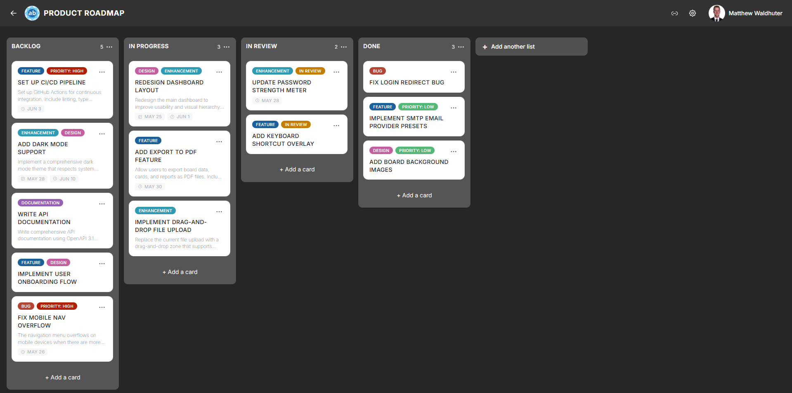

# Cards

Cards are the fundamental units of work in Atlantisboard. Each card represents a task, idea, or item within a [list](lists.md). On the board, cards appear as compact preview tiles that surface key information at a glance.

---

## Creating a Card

1. Open a board and locate the list where you want to add the card.
2. Click the **Add card** button (located at the top or bottom of the list, depending on your [List Settings](board-settings-list.md) configuration for default card position).
3. Type a title for the card and press **Enter** or click the confirm button.

The card appears immediately in the list and is synced to all connected users in real time.

---

## Card Preview Anatomy

Each card on the board displays a compact preview with several visual elements. Most of these can be individually toggled on or off from [Board Settings → Card Settings](board-settings-card.md).

### Visual Elements

From top to bottom, a card preview can show:

| Element | Description | Toggleable |
|---------|-------------|------------|
| **Cover image** | A selected attachment image displayed at the top of the card. | — |
| **Colour stripe / tint** | A background colour applied to the card, useful for visual categorisation. | — |
| **Title** | The card's name, with emoji rendering support. Always visible. | No |
| **Label colour chips** | Small coloured rectangles representing assigned labels. | Yes |
| **Description indicator** | Either a 2-line text preview of the description or a small icon indicating a description exists. | Yes |
| **Date badges** | Start date, due date, and end date with icons and status colours (upcoming, overdue, complete). | Yes (per date type) |
| **Assignee avatars** | Profile pictures of assigned members (up to 4 shown, with a `+N` overflow indicator for additional assignees). | Yes |
| **Checklist progress** | A progress bar or fraction showing completed vs. total checklist items. | Yes |
| **Attachment count** | A paperclip icon with the number of attached files. | Yes |
| **Comment count** | A speech-bubble icon with the number of comments. | Yes |

### Date Badge Colours

Date badges use colour coding to communicate urgency:

- **Default** — the date is in the future and not yet approaching.
- **Upcoming** — the due date is approaching soon (visual highlight).
- **Overdue** — the due date has passed without the card being marked complete (red/warning colour).
- **Complete** — the card has been marked as done (green/success colour).

---

## Opening a Card

Click anywhere on a card preview to open the full [Card Detail](card-detail.md) modal, where you can edit all card properties — description, dates, checklists, comments, attachments, and more.

---

## Card Context Menu

Each card has a three-dot button (visible on hover on desktop, or via long-press on mobile) that opens a quick-access context menu with actions such as:

- **Set card colour** — apply a background colour tint.
- **Rename** — edit the card title inline.
- **Quick actions** — shortcuts to common operations without opening the full detail modal.

---

## Card Size

Cards can be displayed in two sizes, configurable in [Board Settings → Card Settings](board-settings-card.md):

- **Small** — compact cards with minimal padding, ideal for boards with many cards.
- **Medium** — slightly more spacious cards with more room for badge elements.

---

## Related Pages

- [Card Detail](card-detail.md) — the full card editing experience with descriptions, checklists, comments, and more.
- [Lists & Columns](lists.md) — the lists that contain cards.
- [Drag & Drop](drag-and-drop.md) — moving cards between lists.
- [Board Settings: Card Settings](board-settings-card.md) — toggle which badge elements appear on card previews.
