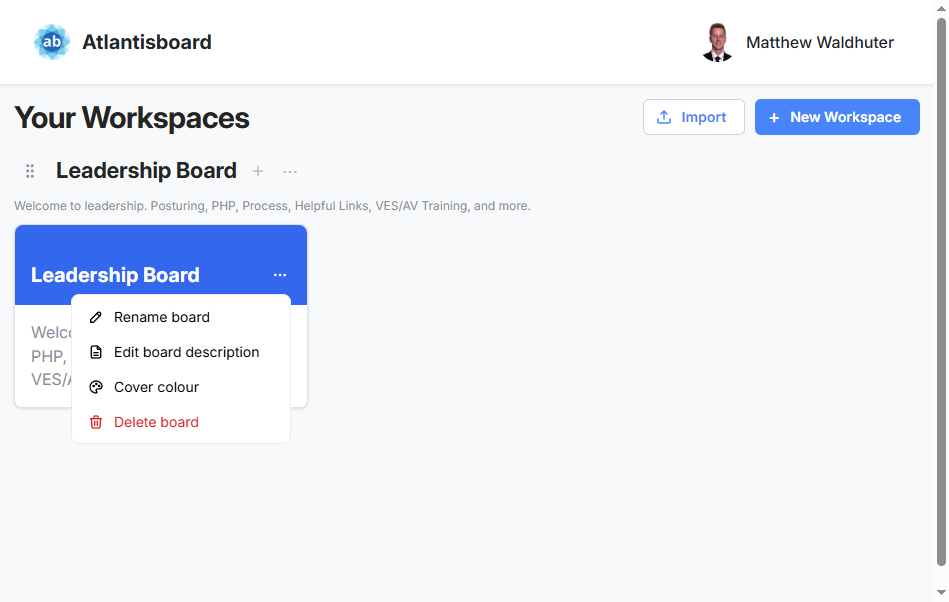

# Your home screen: workspaces and boards

[← Wiki home](Home.md)

The **home hub** is where you see every **workspace** you belong to and the **boards** inside them. From here you open a board, create new boards, import data, and tidy the order of things.

---

## Empty first visit

If nothing exists yet, the page explains that you can create a **private workspace** first, then add boards. That is normal on a new account.

---

## Workspaces

- Each workspace is a **section** of your home screen with its own title.  
- Workspaces can be **yours** or **shared** with you — shared ones might limit who can add boards.  
- Use the **plus** or workspace menus (your admin labels may vary) to **add a board** when you have permission.

---

## Board tiles

- Click a **board tile** to open that board.  
- If you are allowed, you can **drag** board tiles to reorder them within a workspace or move them between workspaces — a small way to keep favorites on top.

---

## Creating a workspace or board

Where the buttons live depends on your permissions. Usually:

- **New workspace** — from the home header area or workspace menu.  
- **New board** — plus icon near a workspace title, or a global “add board” action.

You will be asked for a **name**; everything else you can adjust later inside the board or its settings.

---

## Import

If your role allows it, you can open an **import** flow from the home hub to bring in boards or data from supported formats (your admin can tell you which formats are turned on for your server).

---

## Workspace URL placeholder

There may be a dedicated **workspace** page in the address bar that still says “placeholder.” Day-to-day, use the **home hub** for the same information until that page grows up.

Next: [Boards and cards](boards-and-cards.md) or [Import and export](import-export.md).
