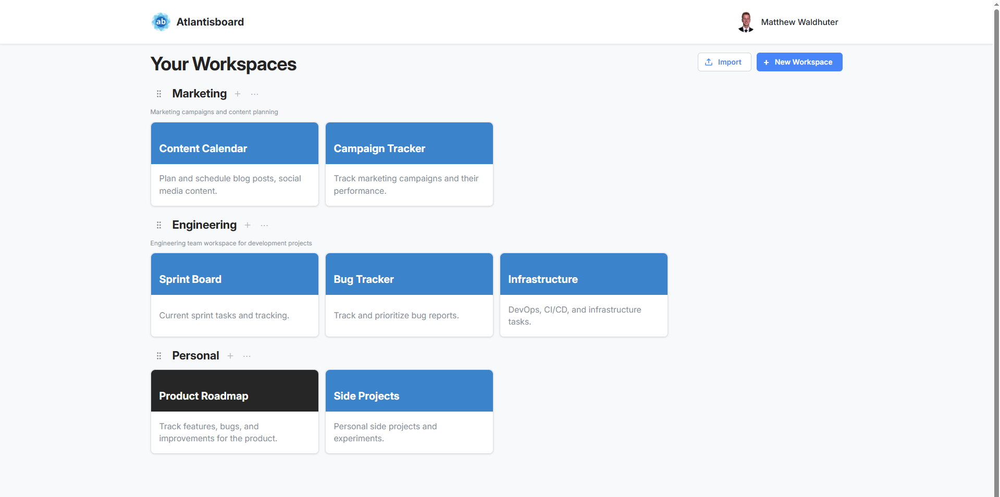

# The Home Page

The home page is your central hub in Atlantisboard. Every board you own or belong to is accessible from here, organised into workspace sections that you can arrange to suit the way you work.

---

## Page Layout

The home page is divided into three main zones:

1. **Navigation bar** — spans the top of the screen. Displays the brand icon and label (both customisable by an admin via [App Branding](admin-app-branding.md)), along with your user avatar and account menu on the right.
2. **Workspace sections** — the main content area. Each workspace you belong to appears as a titled row containing its boards.
3. **Action buttons** — contextual buttons for creating workspaces, importing boards, and adding boards within a workspace (all permission-gated).

### Navigation Bar

The navbar includes:

- **Brand icon and label** — defaults to the Atlantisboard logo and name. Admins can replace these under [App Branding](admin-app-branding.md).
- **User menu** — click your avatar in the top-right corner to access profile settings, theme preference, notification preferences, and sign-out.
- **Admin link** — visible to App Admins, providing quick access to the admin configuration panel.

---

## Workspace Sections

Each workspace is rendered as a collapsible section on the home page. The workspace header shows the workspace name, and the body contains a grid of board tile cards.

- **Workspace ordering** — drag workspace rows up or down to reorder them. The order is saved per user.
- **Create Workspace** — the "Create Workspace" button appears for users who have the workspace creation capability. See [Workspaces](workspaces.md) for details.
- **Import** — an "Import" button is available for users with import permissions. See [Importing Boards](import.md) for supported formats.

### Empty State

If you have no workspaces yet, the home page displays a friendly message with guidance on how to get started — either by creating your first workspace or asking an admin to invite you to an existing one.

---

## Board Tile Cards

Within each workspace section, boards are displayed as tile cards in a responsive grid.

Each board tile shows:

- **Board name** — the title of the board.
- **Background colour or theme preview** — a colour swatch reflecting the board's active theme or custom background colour.
- **Quick-access context menu** — a three-dot button that opens actions like rename, change colour, export, and delete. See [Creating & Managing Boards](create-board.md) for the full menu.

### Board Tile Interactions

| Action | How |
|--------|-----|
| Open a board | Click anywhere on the tile |
| Reorder boards | Drag a tile to a new position within the same workspace |
| Move to another workspace | Drag a tile into a different workspace section |
| Context menu | Click the three-dot icon or right-click the tile |

### Drag-and-Drop on the Home Page

Both workspace rows and board tiles support drag-and-drop:

- **Reorder workspace rows** — grab a workspace header and drag it to change its position among your other workspaces.
- **Move board tiles** — drag a board tile from one workspace into another to reassign it.

Changes are persisted immediately and reflected across all your sessions.

---

## Responsive Layout

The home page adapts to your screen size:

- **Desktop** — board tiles are arranged in a multi-column grid within each workspace section, making efficient use of wide screens.
- **Tablet** — the grid collapses to fewer columns while maintaining the tile layout.
- **Mobile** — tiles stack vertically in a single column for easy thumb navigation. Workspace sections remain collapsible for quick access.

---

## Related Pages

- [Workspaces](workspaces.md) — managing workspace settings, members, and descriptions.
- [Creating & Managing Boards](create-board.md) — the board creation modal and board card context menu.
- [App Branding](admin-app-branding.md) — customising the navbar icon, label, and homepage background.
