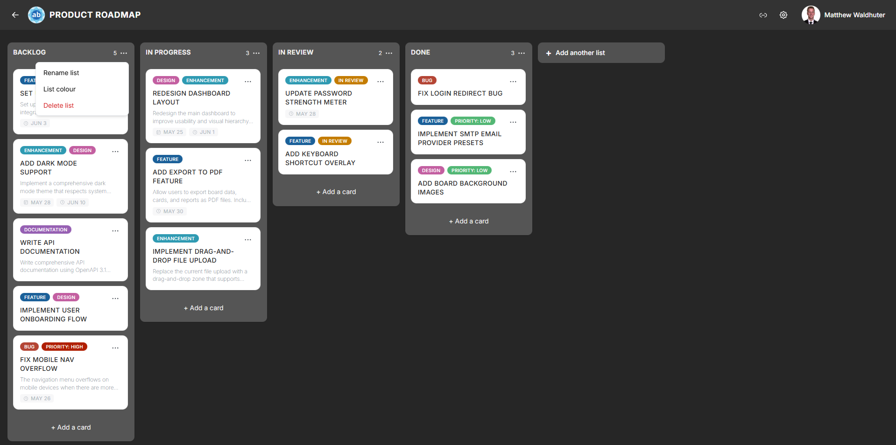

# Lists & Columns

Lists are the vertical columns on a board that organise cards into workflow stages. A typical board might have lists like "To Do", "In Progress", and "Done", but you can name and arrange lists however you like.

---

## Creating a List

1. Open a board.
2. Click the **Add list** button at the end of the list row (the position — left or right — is configurable in [List Settings](board-settings-list.md)).
3. Type a name for the new list and press **Enter** or click the confirm button.

The new list appears immediately and is synced to all connected users in real time.

---

## Renaming a List

Click directly on a list's title text in the header to enter inline edit mode. Type the new name and press **Enter** or click away to save. The rename is reflected across all connected clients instantly.

---

## Reordering Lists

Drag a list by its header to move it left or right among the other columns. Drop it in the desired position and the new order is saved automatically. List reordering requires the `lists.reorder` permission.

See [Drag & Drop](drag-and-drop.md) for details on how the drag system works.

---

## List Actions Menu

Click the menu icon (or right-click) on a list header to open the list actions menu:

| Action | Description |
|--------|-------------|
| **Set list colour** | Choose a colour for the list header. You also have the option to apply the same colour to all cards in the list. |
| **Rename list** | Opens the title for inline editing (same as clicking the title). |
| **Delete list** | Permanently removes the list **and all its cards**. A confirmation dialog warns you before proceeding. |

---

## Card Count Badge

An optional badge in the list header displays the number of cards currently in the list. This is useful for quickly gauging workload distribution across lists.

- **Enable or disable** the card count badge from [Board Settings → Card Settings](board-settings-card.md) using the "Card counter on lists" toggle.
- The count updates in real time as cards are added, moved, or removed.

---

## List Width

The default column width for lists is configurable in [Board Settings → List Settings](board-settings-list.md):

- **Range**: 140 px to 800 px.
- All lists on a board share the same width setting.
- Adjusting the width helps accommodate boards with many short-titled cards (narrow lists) or boards where cards have long descriptions (wider lists).

---

## Work-in-Progress (WIP) Limits

WIP limits help enforce workflow discipline by capping the number of cards allowed in a list:

- **Range**: 1 to 100,000 cards.
- **Hard limit** — when the card count reaches the limit, no new cards can be added to the list. The "Add card" button is disabled.
- **Soft limit** — when the card count reaches the limit, a visual warning appears on the list header, but cards can still be added.

Configure WIP limits in [Board Settings → List Settings](board-settings-list.md).

---

## Deleting a List

Deleting a list removes the list and **all cards it contains** permanently. This action cannot be undone.

1. Open the list actions menu.
2. Click **Delete list**.
3. Confirm the deletion in the dialog that appears.

Deletion requires the appropriate list management permission.

---

## Related Pages

- [Board Overview](board-overview.md) — overall board layout and navigation.
- [Cards](cards.md) — creating and managing cards within lists.
- [Drag & Drop](drag-and-drop.md) — reordering lists and moving cards.
- [Board Settings: Card Settings](board-settings-card.md) — toggle the card count badge.
- [Board Settings: List Settings](board-settings-list.md) — configure list width and WIP limits.
