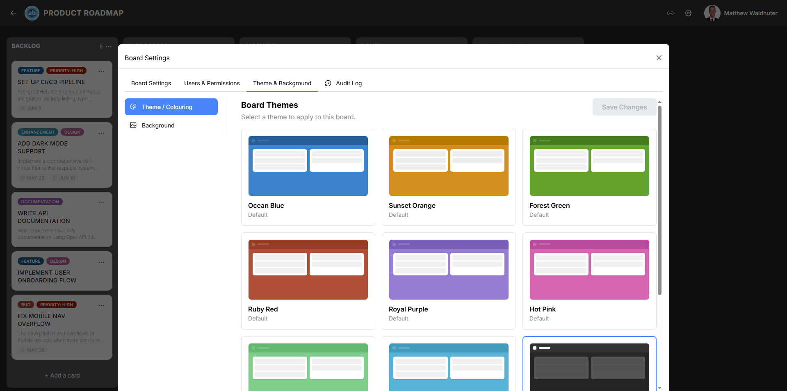

# Themes

Atlantisboard's theming system lets each board wear its own visual identity. Themes control the colours of the navbar, list columns, card detail modal, and scrollbars — creating a cohesive look that suits your team's style or project branding.

---

## How Themes Work

Each theme defines a palette of **CSS custom properties** (also known as CSS variables) that are applied to board interface elements. When you select a theme, the corresponding custom property values are injected into the board's DOM, and every styled element updates instantly.

### The 20 Named Colour Slots

The theme palette consists of 20 colour slots organised into four sections:

#### Navbar (2 slots)

| Slot | Purpose |
|------|---------|
| Navbar background | The background colour of the board navigation bar. |
| Navbar border/icon colour | The colour of navbar borders and icon elements. |

#### Lists / Columns (8 slots)

| Slot | Purpose |
|------|---------|
| List background | The background colour of list columns. |
| List header text | The colour of list title text. |
| List muted text (shade 1) | Lighter secondary text within lists. |
| List muted text (shade 2) | Even lighter tertiary text or metadata. |
| List control hover background | Background colour when hovering over list action buttons. |
| List shadow | The shadow colour beneath list columns. |
| Add-list button background | Background of the "Add list" button. |
| Add-list button hover | Hover state for the "Add list" button. |

#### Card Detail Window (7 slots)

| Slot | Purpose |
|------|---------|
| Card detail background | Background of the card detail modal. |
| Title text | Card title colour. |
| Body text | Card body and description text colour. |
| Button background | Background of action buttons in the card modal. |
| Button text | Text colour on action buttons. |
| Button hover background | Hover state background for buttons. |
| Button hover text | Hover state text colour for buttons. |

#### Scrollbars (1 slot)

| Slot | Purpose |
|------|---------|
| Scrollbar thumb colour | The colour of custom scrollbar handles throughout the board. |

> **Note:** Two additional slots are reserved for the canvas background colour and potential future use, bringing the effective total to 20.

---

## Default Themes

Atlantisboard ships with 8 professionally designed system themes. These are available in every installation and cannot be edited or deleted — but they can be **duplicated** to create an editable custom copy.

---

### Ocean Blue

The default theme for all new boards. Ocean Blue uses calm, deep blue tones that evoke open water and clear skies. It provides excellent contrast and readability for long work sessions.

- **Navbar:** Deep navy blue
- **Lists:** Light blue-grey backgrounds with crisp white card areas
- **Accents:** Bright blue interactive elements
- **Mood:** Professional, focused, serene

---

### Sunset Orange

Warm orange and amber hues inspired by golden-hour skies. Sunset Orange brings energy and warmth to your workspace without sacrificing readability.

- **Navbar:** Rich burnt orange
- **Lists:** Warm cream and soft peach backgrounds
- **Accents:** Amber highlights and golden interactive elements
- **Mood:** Warm, creative, inviting

---

### Forest Green

Natural, earthy green tones evoking dense woodland and fresh foliage. Forest Green creates a calm, grounded atmosphere ideal for focused work.

- **Navbar:** Deep forest green
- **Lists:** Light sage and muted olive backgrounds
- **Accents:** Vibrant leaf green for interactive elements
- **Mood:** Natural, grounded, refreshing

---

### Ruby Red

Bold, confident reds with a gemstone-like richness. Ruby Red makes a strong visual statement and works well for high-priority or time-sensitive projects.

- **Navbar:** Deep ruby/crimson
- **Lists:** Soft rose and warm grey backgrounds
- **Accents:** Bright red highlights for actions
- **Mood:** Bold, urgent, powerful

---

### Royal Purple

Deep, regal purple tones with a luxurious feel. Royal Purple conveys sophistication and creativity, making it popular for design and strategy boards.

- **Navbar:** Rich purple/violet
- **Lists:** Soft lavender and muted violet backgrounds
- **Accents:** Bright amethyst interactive elements
- **Mood:** Sophisticated, creative, elegant

---

### Hot Pink

Vibrant, energetic pink that commands attention. Hot Pink is unapologetically bold — ideal for teams who want their workspace to feel dynamic and fun.

- **Navbar:** Vivid magenta/hot pink
- **Lists:** Light pink and soft rose backgrounds
- **Accents:** Bright fuchsia interactive elements
- **Mood:** Energetic, playful, bold

---

### Mint Green

Fresh, cool mint and seafoam for a relaxed aesthetic. Mint Green provides a soothing visual environment with excellent readability.

- **Navbar:** Cool mint green
- **Lists:** Very light mint and white backgrounds
- **Accents:** Medium green interactive elements
- **Mood:** Fresh, calm, light

---

### Teal

Sophisticated blue-green tones balancing warmth and calm. Teal occupies the sweet spot between blue's professionalism and green's natural feel.

- **Navbar:** Deep teal/blue-green
- **Lists:** Light teal and soft aqua backgrounds
- **Accents:** Bright cyan interactive elements
- **Mood:** Balanced, modern, versatile

---

## Choosing a Theme

Consider these factors when selecting a theme:

- **Readability** — All default themes are designed for comfortable extended use. Enable [Intelligent Contrast](board-settings-theme.md) for automatic accessibility adjustments.
- **Context** — Match the theme to the project's personality. A client-facing project might suit Ocean Blue, while an internal brainstorm board could use Hot Pink.
- **Team preference** — Since themes are per-board, different teams can each have their preferred aesthetic without conflict.

---

## Customisation

If none of the default themes quite fit, you have two options:

1. **Duplicate and modify** — Duplicate any system theme to create an editable copy, then adjust colours to taste.
2. **Create from scratch** — Open the [Custom Theme Editor](theme-editor.md) and build a completely new palette.

---

## Related Pages

- [Theme & Colouring (Board Settings)](board-settings-theme.md) — Apply themes to a specific board.
- [Custom Theme Editor](theme-editor.md) — Create and edit custom themes.
- [Theme Sharing & Management](theme-sharing.md) — Permissions and theme lifecycle.
